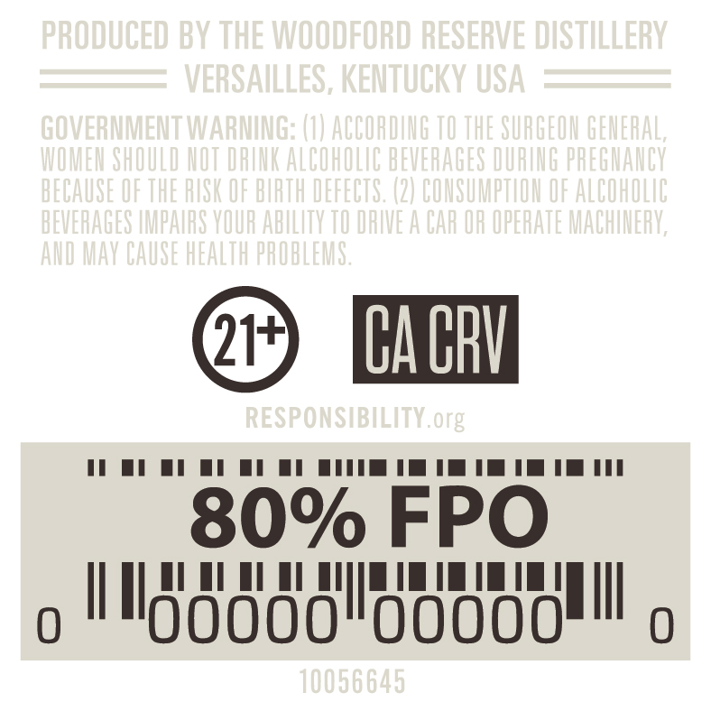
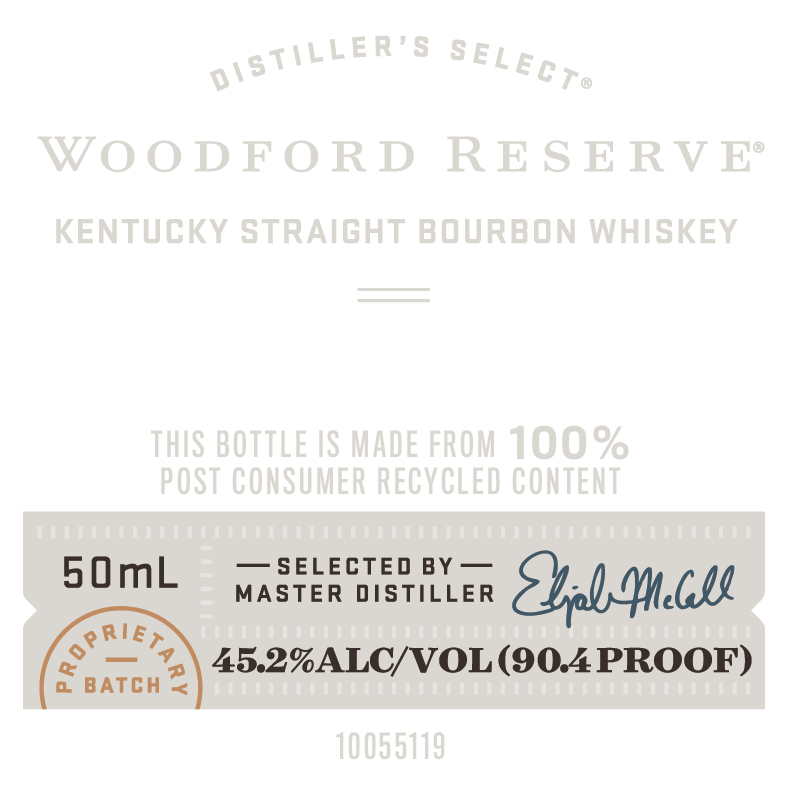

# TTB COLA Label Images - TTBID 26229001000150

**Brand Name:** WOODFORD RESERVE

**Issue Date:** 08/24/2026

**Origin Code:** 22

**Product Class/Type:** 101

**Source:** [TTB Public COLA Registry](https://ttbonline.gov/colasonline/viewColaDetails.do?action=publicFormDisplay&ttbid=26229001000150)

## Label Images

### Back Label

### Front Label

## Extracted Label Text

*Text extracted via OCR - may contain errors*

**Detected Proof:** 90.4

### Back Label

PRODUCED BY THE WOODFORD RESERVE DISTILLERY
VERSAILLES , KENTuCKV USA
GOVERMMENT WARNING: (1) ACCORDING TO THE SURGEOM GEMERAL;
IOMEM SHOULD NOT DRIMK ALCOHOLIC BEVERAGES DURING PREGMAMCY
BECAUSE OF THE RUSK OF BURTH DEFECTS, (24 COMSUMPTHOM OF AlCohOlic
BEUERAGES IMPAIRS VOUR ABILITV TO DRIE A CAR OR OPERATE MACHIMERV;
AND MAv CAUSE HEALTH PROBLEMS,
22
CA CRV
RESPONSIBILITY.org
80% FPO
ooooo"ooooo
10056645

### Front Label

WooDFOR D
RE S E RV Ee
KenTUCKY StrAiGHT BouRbon WHISKEY
THIS BOTTLE /S MADe FROM 100%
POST CONSUMER RECYCLED CONTENT
5OmL
SELECTED
BY
MASTER DISTILLER
Zlaa.al
RIE
45.2%ALC/VOL (904 PROOF)
BATCH
10055119
0ISTiller'8
SELECTe
