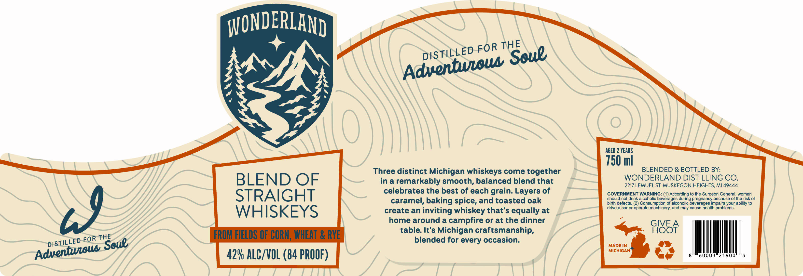

# TTB COLA Label Images - TTBID 26229001000152

**Brand Name:** WONDERLAND

**Issue Date:** 08/25/2026

**Origin Code:** 06

**Product Class/Type:** 129

**Source:** [TTB Public COLA Registry](https://ttbonline.gov/colasonline/viewColaDetails.do?action=publicFormDisplay&ttbid=26229001000152)

## Label Images

### Label 1

## Extracted Label Text

*Text extracted via OCR - may contain errors*

**Detected Proof:** 84
**Detected Age:** 2 Years

### Label 1

IONDERLAND
FOR
AGED 2 YEARS
750 ml
Three distinct Michigan whiskeys come together
BLENDED & BOTTLED BY:
BLEND OF
in a
remarkably smooth, balanced blend that
WONDERLAND DISTILLING CO.
2217 LEMUEL ST. MUSKEGON HEIGHTS, MI 49444
STRAIGHT
celebrates the best of each grain: Layers of
GOVERNMENT WARNING: (1) According to the Surgeon General, women
caramel, baking spice, and toasted oak
should not drink alcoholic beverages during pregnancy because of the risk of
birth defects. (2) Consumption of alcoholic beverages impairs your abllity to
drive
car Or operale machinery; and may cause health problems.
WHISKEYS
create an
inviting whiskey that's equally at
home around a campfire or at the dinner
GIVE _
FROM FIELDS OF CORN, WHEAT & RYE
table: It's
Michigan craftsmanship,
GI85F
blended for every occasion:
MADE IN
MICHIGAN
42V ALC/VOL (84 PROOF)
THE
DISTiLLED
Soue
Adventweou
39
THE
FOR
DISTiLLED
Soue
Adventeow
