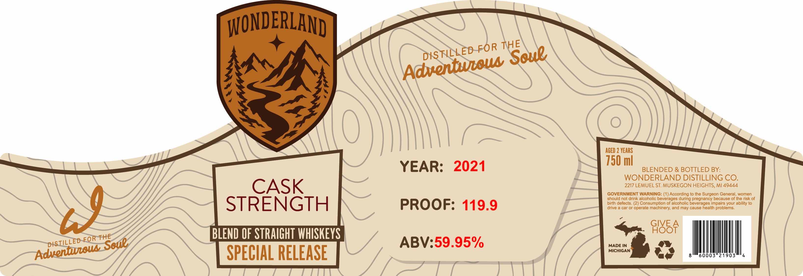

# TTB COLA Label Images - TTBID 26229001000155

**Brand Name:** WONDERLAND

**Issue Date:** 08/25/2026

**Origin Code:** 06

**Product Class/Type:** 129

**Source:** [TTB Public COLA Registry](https://ttbonline.gov/colasonline/viewColaDetails.do?action=publicFormDisplay&ttbid=26229001000155)

## Label Images

### Label 1

## Extracted Label Text

*Text extracted via OCR - may contain errors*

**Detected Proof:** 119.9

### Label 1

WONDERLAND I
THE
ACED 2 VeaRS
YEAR:
2021
750 ml
BLENDED & BOTTLED BY:
WONDERLAND DISTILLING CO.
CASK
2217 LEMUEL ST MUSKEGON HEIGHTS, MI 49444
GOVERNMENT WARNING: (1) According to the Surgeon General women
should not drink alcoholic beverages during pregnancy because of the risk of
STRENGTH
PROOF: 119.9
birh defects
Consumption of alcoholic beverages Impairs your ability t0
W
drive
car or operate machinery; and may cause health problems:
GIVE
9I85F
FOR THE
BLEND OF STRAIGHT WHISKEYS
ABV:59.95%
MADE IN
SPECIAL RELEASE
MICHIGAN
60003"21903
FOR
DKSTILLED
Soue
Adventwuow
DISTILLED
Soue
Adventuoua
