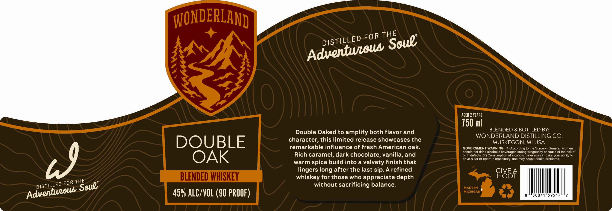

# TTB COLA Label Images - TTBID 26229001000160

**Brand Name:** WONDERLAND

**Issue Date:** 09/02/2026

**Origin Code:** 22

**Product Class/Type:** 137

**Source:** [TTB Public COLA Registry](https://ttbonline.gov/colasonline/viewColaDetails.do?action=publicFormDisplay&ttbid=26229001000160)

## Label Images

### Back Label

## Extracted Label Text

*Text extracted via OCR - may contain errors*

**Detected Proof:** 90
**Detected Age:** 2 Years

### Back Label

WONDERLAND
AGED 2 years
150 ml
BLENDED & BOTTLED BY:
Double Oaked to amplify both flavor and
WONDERLAND DISTILLING CO.
DOUBLE
character, this limited release showcases the
MUSKEGON,MI USA
remarkable influence of fresh American oak:
GOVERNMENT WARNING: (1) According {0 Ihe Surgeon General woman
should not drink alcohollc beverages during pregnancy because of the risk of
OAK
Rich caramel, dark chocolate, vanilla, and
birth defects. (2) Consumplion ol alcoholic beverages impairs your abllily t0
WJ
warm spice build into a velvety finish that
drive & car or operate machinery; and may cause health problems
lingers long after the last sip. A refined
GIVE
BLENDED WHISKEY
whiskey for those who appreciate depth
GI8BA
FOR
without sacrificing balance:
MADE IN
45V ALC/VOL (90 PROOF)
MICHIGAN
THE
FOR
DISTILLED
Soue;
Adventwloua
THE
Soue"
DISTILLED
Adventwioua
