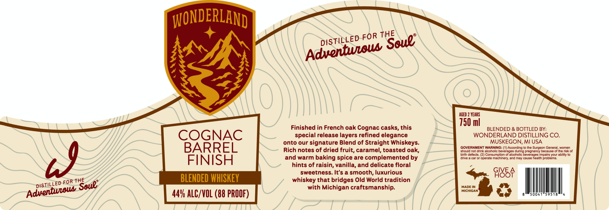

# TTB COLA Label Images - TTBID 26229001000162

**Brand Name:** WONDERLAND

**Issue Date:** 09/02/2026

**Origin Code:** 06

**Product Class/Type:** 137

**Source:** [TTB Public COLA Registry](https://ttbonline.gov/colasonline/viewColaDetails.do?action=publicFormDisplay&ttbid=26229001000162)

## Label Images

### Label 1

## Extracted Label Text

*Text extracted via OCR - may contain errors*

**Detected Proof:** 88
**Detected Age:** 2 Years

### Label 1

WONDERLAND
AGED 2 YEARS
750 ml
Finished in French oak Cognac casks, this
BLENDED & BOTTLED BY:
COGNAC
special release layers refined elegance
WONDERLAND DISTILLING CO.
onto our
signature Blend of Straight Whiskeys.
MUSKEGON, MI USA
BARREL
GOVERNMENT WARNING: (1) According to the Surgeon General, women
Rich notes of dried fruit, caramel, toasted oak,
should not drink alcoholic beverages during pregnancy because of the risk of
birth defects. (2) Consumption of alcoholic beverages impairs your ability to
19
FINISH
and warm baking spice are complemented by
drive
car Or operate machinery; and may cause health problems
hints of raisin, vanilla, and delicate floral
sweetness: It's a smooth, luxurious
GIVE .
GI8SF
BLENDED WHISKEY
whiskey that bridges Old World tradition
with Michigan craftsmanship:
MADE IN
MICHIGAN
44V ALC/VOL (88 PROOF)
THE
FOR
DISTILLED
Soue;
Adventeows
THE
FOR
DISTiLLED
Soue"
Adventeow
