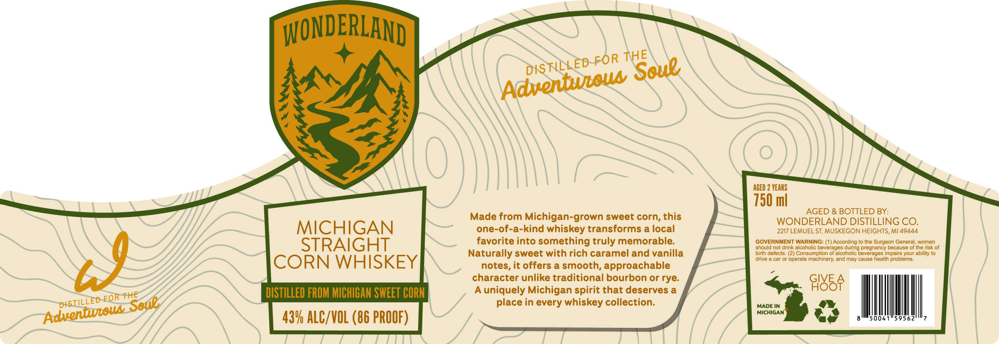

# TTB COLA Label Images - TTBID 26229001000170

**Brand Name:** WONDERLAND

**Issue Date:** 08/24/2026

**Origin Code:** 06

**Product Class/Type:** 103

**Source:** [TTB Public COLA Registry](https://ttbonline.gov/colasonline/viewColaDetails.do?action=publicFormDisplay&ttbid=26229001000170)

## Label Images

### Label 1

## Extracted Label Text

*Text extracted via OCR - may contain errors*

**Detected Proof:** 86

### Label 1

WONDERLAND
AcEd 2 VEARS
750 ml
AGED & BOTTLED BY:
Made from Michigan-grown sweet corn, this
WONDERLAND DISTILLING CO.
MICHIGAN
one-of-a-kind whiskey transforms a local
2217 LEMUEL ST. MUSKEGON HEIGHTS, Ml 49444
STRAIGHT
favorite into something truly memorable:
GOVERNMENT WARNING: ( 1) According t0 the Surgeon General, women
should not drink
Icohollc beverages during pregnancy because of the risk of
Naturally sweet with rich caramel and vanilla
birth defects. (2) Consumption of alcohollc beverages Impairs your abllily t0
N
CORN WHISKEY
notes, it offers a smooth; approachable
drive
car or operale machlnery and may cause heallh problems_
character unlike traditional bourbon or rye:
GIVE
DISTILLED FROM MICHIGAN SWEET CORN
A
uniquely Michigan spirit that deserves a
9l85F
place in every whiskey collection:
MADE IN
MIcHIGAN
43V ALC/VOL (86 PROOF)
THE
DKSTILLED FOR
Soue
Adventutou
THE
FOR
DISTILLED
Sony
Aduennuroud
