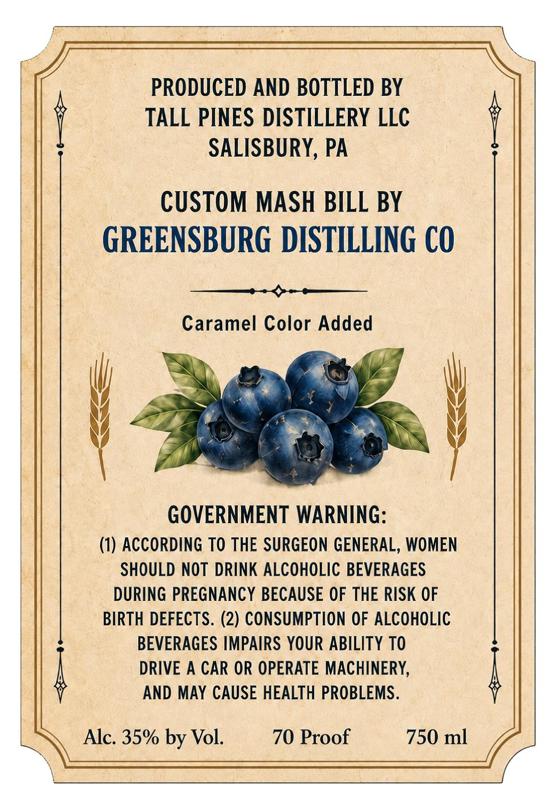
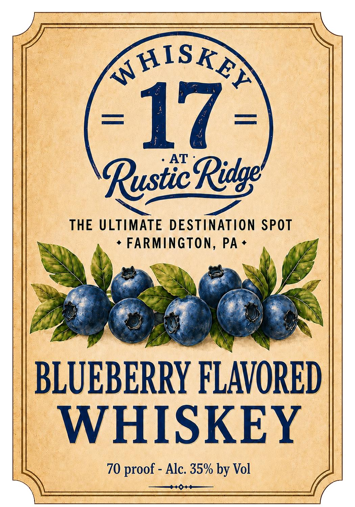

# TTB COLA Label Images - TTBID 26229001000172

**Brand Name:** WHISKEY 17 AT RUSTIC RIDGE

**Fanciful Name:** BLUEBERRY WHISKEY

**Issue Date:** 08/31/2026

**Origin Code:** 39

**Product Class/Type:** 149

**Source:** [TTB Public COLA Registry](https://ttbonline.gov/colasonline/viewColaDetails.do?action=publicFormDisplay&ttbid=26229001000172)

## Label Images

### Back Label

### Front Label

## Extracted Label Text

*Text extracted via OCR - may contain errors*

**Detected Proof:** 140

### Back Label

PRODUCED AND BOTTLED BY
TALL PINES DISTILLERY LLC
SALISBURY, PA
CUSTOM MASH BILL BY
GREENSBURG DISTILLING €O
Caramel Color Added
GOVERNMENT WARNING:
(1) ACCORDING TO THE SURGEON GENERAL, WOMEN
SHOULD NOT DRINK ALCOHOLIC BEVERAGES
DURING PREGNANCY BECAUSE OF THE RISK OF
BIRTH DEFECTS. (2) CONSUMPTION OF ALCOHOLIC
BEVERAGES IMPAIRS YOUR ABILITY TO
DRIVE
A CAR OR OPERATE MACHINERY,
AND MAY CAUSE HEALTH PROBLEMS .
Alc. 35% by Vol.
70 Proof
750 ml

### Front Label

AHISKA
17
AT
RysticRitge
THE ULTIMATE DESTiNATiO SpoT
FARMINGTON, PA
BLUEBERRY FLAVORED
WHISKEY
70 proof -
Alc; 35% by Vol
