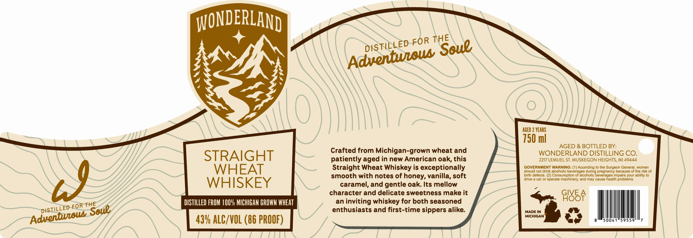

# TTB COLA Label Images - TTBID 26229001000177

**Brand Name:** WONDERLAND

**Issue Date:** 08/24/2026

**Origin Code:** 06

**Product Class/Type:** 109

**Source:** [TTB Public COLA Registry](https://ttbonline.gov/colasonline/viewColaDetails.do?action=publicFormDisplay&ttbid=26229001000177)

## Label Images

### Label 1

## Extracted Label Text

*Text extracted via OCR - may contain errors*

**Detected Proof:** 86

### Label 1

WONDERLAND
Aced 2 VEARS
750 ml
AGED & BOTTLED BY:
Crafted from Michigan-grown wheat and
WONDERLAND DISTILLING CO.
STRAIGHT
patiently aged in new American oak, this
2217 LEMUEL ST. MUSKEGON HEIGHTS, Ml 49444
WHEAT
Straight Wheat Whiskey is exceptionally
GOVERNMENT WARNING: ( 1) According t0 Ihe Surgeon General, women
should not drink alcohollc beverages during pregnancy because of the risk of
smooth with notes of honey; vanilla, soft
birtn defecls_ (2
Consumplion of alcohollc beverages Impairs your ablllilty l0
N
WHISKEY
drive
car Or operale machlnery; and may cause heallh problems.
caramel, and gentle oak Its mellow
character and delicate sweetness make it
GIVE
9I85F
DISTILLED FROM 1OO % MICHIGAN GROWN WheaT
an
inviting whiskey for both seasoned
enthusiasts and first-time sippers alike:
MADE IN
MICHIGAN
43V ALC/VOL (86 PROOF)
THE
FOR
DISTILLED
Soue
Adventious
THE
FOR
DISTILLED
Soue
Adventueous
