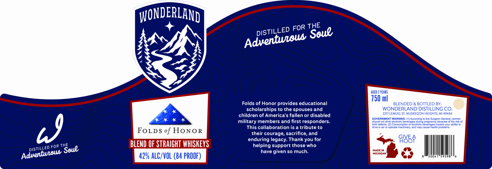

# TTB COLA Label Images - TTBID 26229001000179

**Brand Name:** WONDERLAND

**Issue Date:** 08/25/2026

**Origin Code:** 06

**Product Class/Type:** 129

**Source:** [TTB Public COLA Registry](https://ttbonline.gov/colasonline/viewColaDetails.do?action=publicFormDisplay&ttbid=26229001000179)

## Label Images

### Label 1

## Extracted Label Text

*Text extracted via OCR - may contain errors*

**Detected Proof:** 84
**Detected Age:** 2 Years

### Label 1

WONDERLAND
AGED 2 YEARS
750 ml
Folds of Honor provides educational
BLENDED & BOTTLED BY:
scholarships to the spouses and
WONDERLAND DISTILLING CO.
2217 LEMUEL ST. MUSKEGON HEIGHTS, Ml 49444
children of America'$ fallen or disabled
GOVERNMENT WARNING: (1) According to the Surgeon General, women
military members and first responders:
should not drink alcoholic beverages during pregnancy because of the risk of
birth defects. (2) Consumption of alcoholic beverages impairs your ability to
This collaboration is a tribute to
drive a car or operate machinery; and may cause health problems.
FoLDS of HoNo R
their courage, sacrifice, and
enduring legacy: Thank you for
F485F
FOR
BLEND OF STRAIGHT WHISKEYS
helping support those who
have given so much:
MADE IN
MICHIGAN
42V ALC/VOL (84 PROOF)
THE
FOR
DISTILLED
Soue
Adventwlou
9
THE
DISTILLED
Soue
Adventweous
