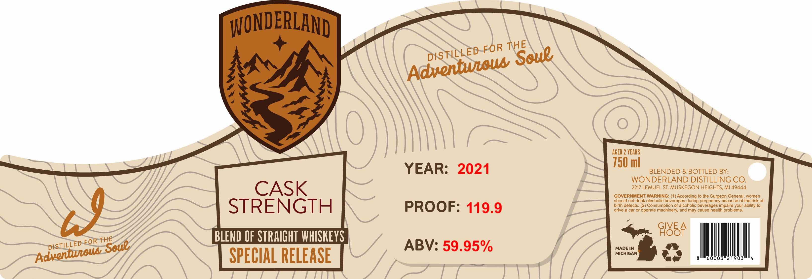

# TTB COLA Label Images - TTBID 26229001000180

**Brand Name:** WONDERLAND

**Issue Date:** 08/24/2026

**Origin Code:** 06

**Product Class/Type:** 129

**Source:** [TTB Public COLA Registry](https://ttbonline.gov/colasonline/viewColaDetails.do?action=publicFormDisplay&ttbid=26229001000180)

## Label Images

### Label 1

## Extracted Label Text

*Text extracted via OCR - may contain errors*

**Detected Proof:** 119.9
**Detected Age:** 2 Years

### Label 1

WONDERLAND I
AGED 2 YEARS
750 ml
YEAR:
2021
BLENDED & BOTTLED BY:
WONDERLAND DISTILLING CO.
CASK
2217 LEMUEL ST MUSKEGON HEIGHTS, Ml 49444
GOVERNMENT WARNING: (1) According to the Surgeon General women
should not drink alcohollc beverages during pregnancy because of the risk of
STRENGTH
PROOF: 119.9
birth defects
Consumption 0f alcoholic beverages Impairs vour ability t0
drive
car or operate machinery; and may cause health problems.
FOR THE
BLEND OF STRAIGHT WHISKEYS
4485F
ABV: 59.95%
MADE IN
SPECIAL RELEASE
MICHIGAN
60003"21903
THE
FOR
DISTILLED
Soue
Adventuala
a?
DISTILLED
Soue
Advenhueoua
