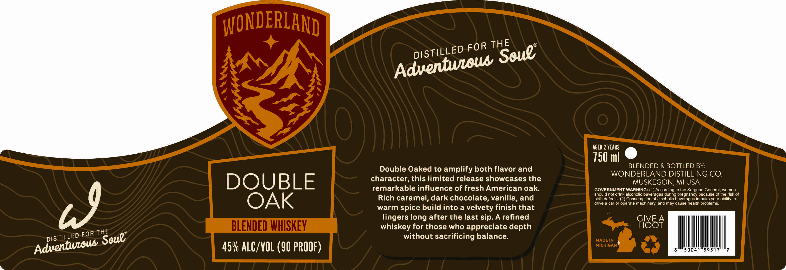

# TTB COLA Label Images - TTBID 26229001000184

**Brand Name:** WONDERLAND

**Issue Date:** 09/02/2026

**Origin Code:** 06

**Product Class/Type:** 137

**Source:** [TTB Public COLA Registry](https://ttbonline.gov/colasonline/viewColaDetails.do?action=publicFormDisplay&ttbid=26229001000184)

## Label Images

### Label 1

## Extracted Label Text

*Text extracted via OCR - may contain errors*

**Detected Proof:** 90
**Detected Age:** 2 Years

### Label 1

WONDERLAND
AGED 2 YEARS
750 ml
Double Oaked to amplify both flavor and
BLENDED & BOTTLED BY:
WONDERLAND DISTILLING CO.
DOUBLE
character, this limited release showcases the
MUSKEGON, MI USA
remarkable influence of fresh American oak:
GOVERNMENT WARNING: (1) According to the Surgeon General women
should not drink alcoholic beverages during pregnancy because of the risk of
OAK
Rich caramel, dark chocolate, vanilla, and
birth defects. (2
Consumption of alcoholic beverages impairs your ability to
drive a car or operale machinery and may cause health problems
warm spice build into a velvety finish that
lingers long after the last sip. A refined
GIVE
BLENDED WHISKEY
whiskey for those who appreciate depth
GI8BA
FOR
without sacrificing balance:
MADE IN
459 ALC/VOL (90 PROOF)
MICHIGAM
THE
FOR
Soue;
DISTILLED
Adventwioua
79
THE
Soue"
DISTILLED
Adventweou
