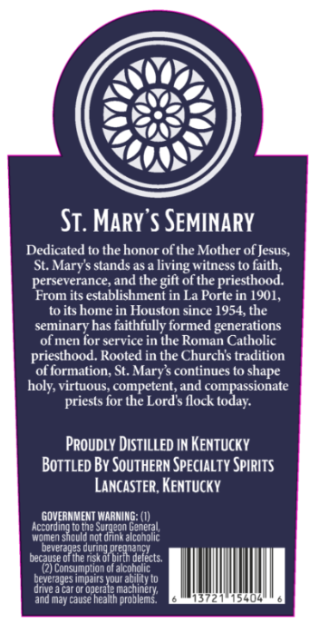
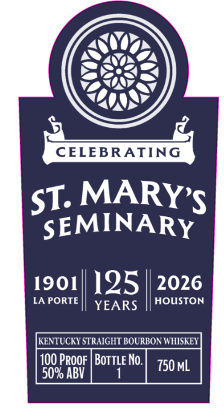

# TTB COLA Label Images - TTBID 26229001000238

**Brand Name:** ST MARY'S

**Issue Date:** 08/25/2026

**Origin Code:** 22

**Product Class/Type:** 101

**Source:** [TTB Public COLA Registry](https://ttbonline.gov/colasonline/viewColaDetails.do?action=publicFormDisplay&ttbid=26229001000238)

## Label Images

### Back Label

### Front Label

## Extracted Label Text

*Text extracted via OCR - may contain errors*

**Detected Proof:** 100

### Back Label

Si: MaRY'$ SEMINARY
Dedicated to the honor ofthe Mother of Jesus;
St. Mary'$ stands as &
witness t0 faith;
perseverance;and the gift of the priesthood.
From its establishment in La Porte in 1901,
to its home in Houston since 1954, the
seminaryhas faithfully formed generations
of men for service in the Roman Catholic
priesthood. Rooted in the Churchs tradition
of formation, St. Marys continues to
holy, virtuous;, competent, and compassionate
for the Lord $ flock today:
Proudly Distilled IN Kentucky
BOTTLED By SouTHERN SPEcIALty Spirits
LancaSTeR, Kentucky
GOVERMMENT WARNING: (I)
NeorelSacena 98ed9n9n Ecoregal
Jhnet
sculd notc
alcoholic
beverages duri
dugina Rreutae
decause Olhe E
Detects:
Consumpilon ol aiconouc
beverageS irpairs Your ability t0
drive J car or operale Ma chinety;
and May Cause hea
'problems
living
shape
priests

### Front Label

CELEBRATING
ST: MARYS
SEMINARY
1901
125
2026
LA PORTE
YEARS
HOUSTON
KENTUCKY STRAIGHT BOURBON WHISKEY
100 Proof | BoTTLe No.
750 mL
50% ABV
