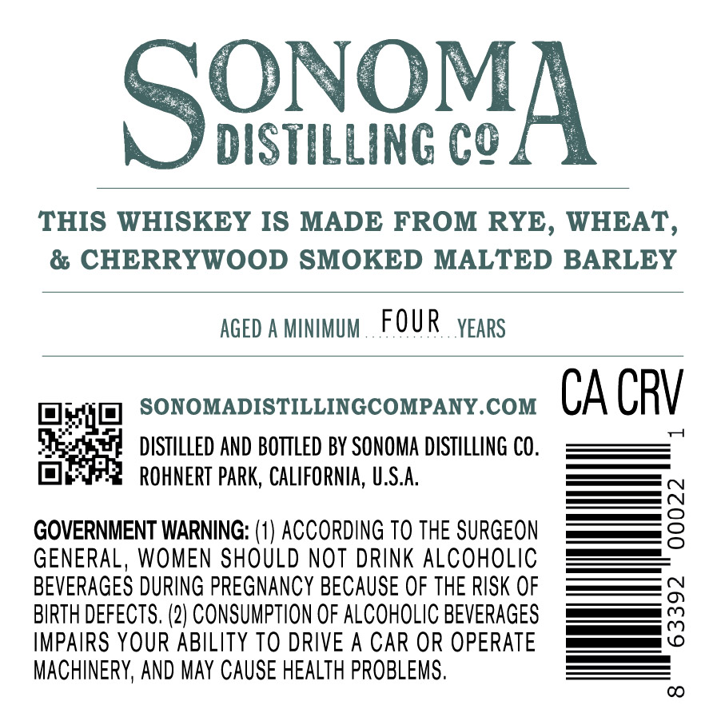
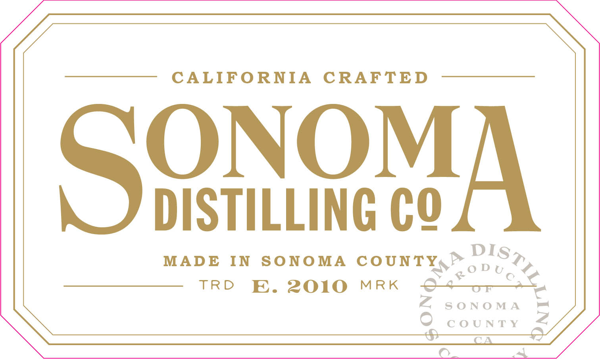
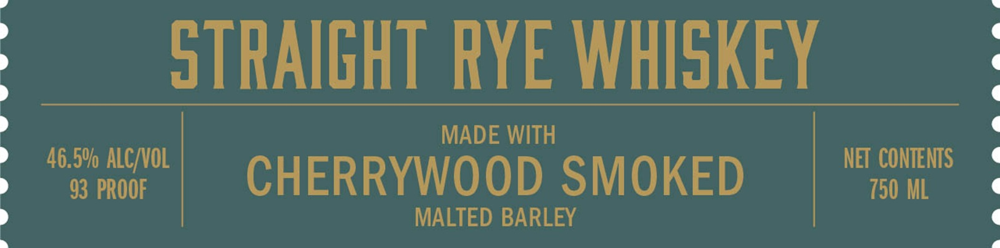
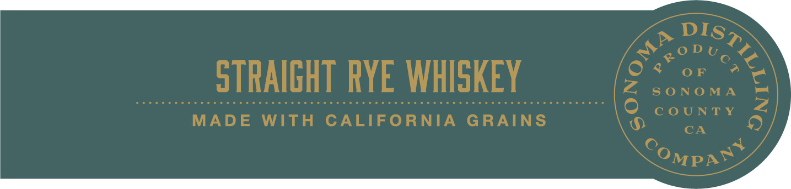

# TTB COLA Label Images - TTBID 26229001000248

**Brand Name:** SONOMA DISTILLING COMPANY

**Issue Date:** 08/25/2026

**Origin Code:** 01

**Product Class/Type:** 102

**Source:** [TTB Public COLA Registry](https://ttbonline.gov/colasonline/viewColaDetails.do?action=publicFormDisplay&ttbid=26229001000248)

## Label Images

### Back Label

### Label 1

### Label 2

### Label 4

## Extracted Label Text

*Text extracted via OCR - may contain errors*

**Detected Proof:** 93

### Back Label

SOOvA
DISTILLING cQ
THIS WHISKEY IS MADE FROM RYE, WHEAT,
& CHERRYWOOD SMOKED MALTED BARLEY
AGED
MINIMUM
FOUR
YEARS
SONOMADISTILLINGCOMPANY.COM
CA CRV
DISTILLED AND BOTTLED BY SONOMA DISTILLING CO.
ROHNERT PARK, CALIFORNIA, U.S.A:
GOVERNMENT WARNING: (1) ACCORDING TO THE SURGEON
8
GENERAL, WOMEN SHOULD NOT DRINK ALCoholiC
BEVERAGES DURING PREGNANCY BECAUSE OF THE RISK OF
BIRTH DEFECTS. (2) CONSUMPTION OF ALCOHOLIC BEVERAGES
8
IMPAIRS YOUR ABILITY TO DRIVE A CAR OR OPERATE
MACHINERY, AND May CAUSE HEALTH PROBLEMS.
CO

### Label 1

CALIFORNIA CRAFTED

ONO

MA

S'

DISTILLING CO

A

spat

MADE IN SONOMA COUNTY,” 6p

TRD E. 2010 MRK

SONOMA =

COUNTY

O_

al

### Label 2

STRAIGHT RYE WHISKEY
MADE WITH
46.5% ALC/VOL
NET CONTENTS
93 PROOF
CHERRYWOOD SMOKED
750 ML
MALTED BARLEY

### Label 4

STRAIGHT RYE WHISKEY

“MADE WITH CALIFORNIA GRAINS
