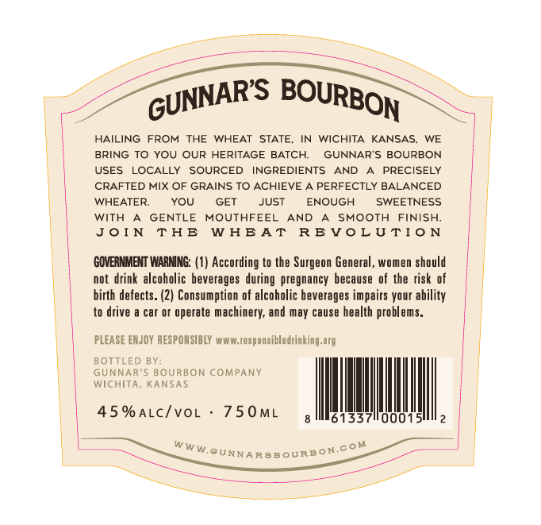
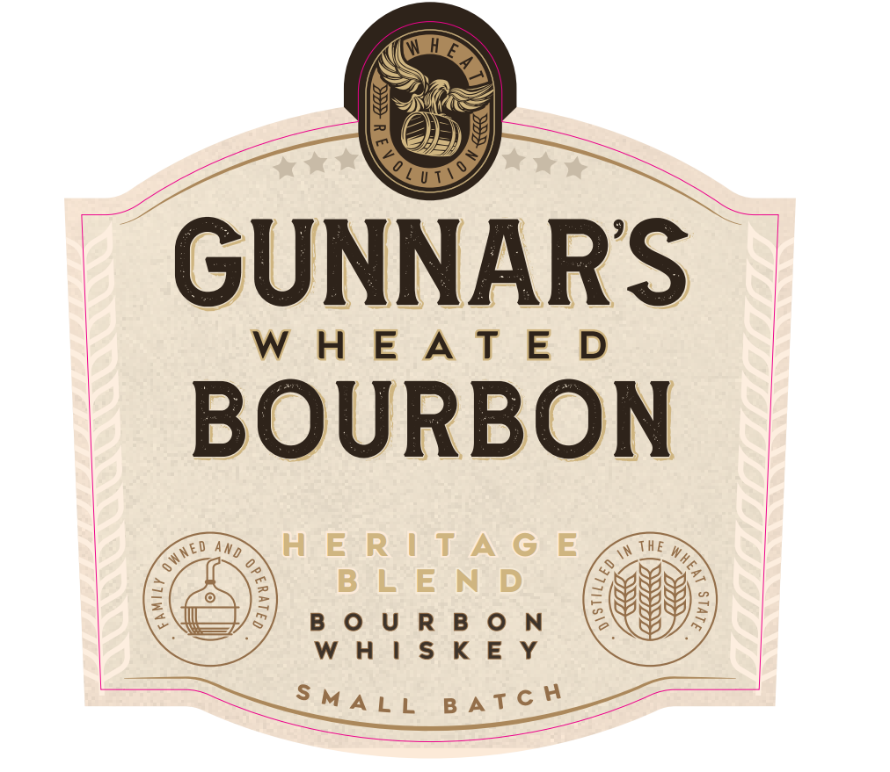
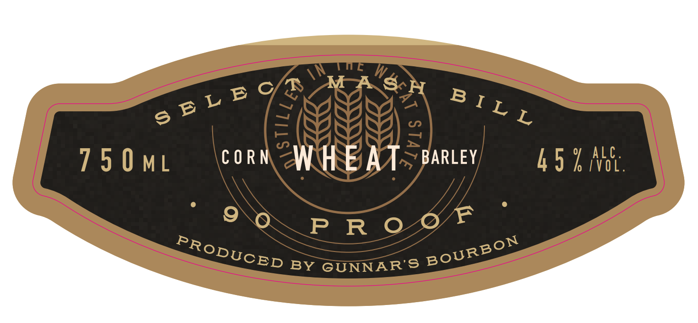
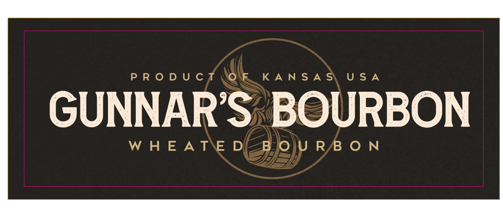

# TTB COLA Label Images - TTBID 26229001000292

**Brand Name:** GUNNAR'S WHEATED BOURBON

**Fanciful Name:** HERITAGE BLEND

**Issue Date:** 08/27/2026

**Origin Code:** 21

**Product Class/Type:** 141

**Source:** [TTB Public COLA Registry](https://ttbonline.gov/colasonline/viewColaDetails.do?action=publicFormDisplay&ttbid=26229001000292)

## Label Images

### Back Label

### Front Label

### Label 2

### Label 3

## Extracted Label Text

*Text extracted via OCR - may contain errors*

*1 image(s) excluded: text did not meet readability threshold*

**Detected Proof:** 90

### Back Label

HAILING
FROM
THE
WHEAT
STATE,
WICHITA
KANSAS,
WE
BRING TO YOU OUR HERITAGE BATCH:
GUNNAR'S BOURBON
USES
LOCALLY
SOURCED
INGREDIENTS
AND
PRECISELY
CRAFTED MIX OF GRAINS TO ACHIEVE
PERFECTLY BALANCED
WHEATER:
YOU
GET
JUST
ENOUGH
SWEETNESS
with
GENTLE
MOUTHFEEL
AND
SMOOTH
FINISH;
J0 [ N
T AE
W AEAT
RE V0 L UTI0 N
GOVERNMENT WARNNG: (1) According to the Surgeon General , women should
not drink alcoholic beverages during pregnancy because of the risk of
birth defects: (2) Consumption of alcoholic beverages impairs your ability
to drive
car Or operate
machinery; and may cause health problems:
PLEASE EMJOY RESPONSIBLY www.responsibledrinking org
BOTTLED BY;
GUNNAR'5 BOURBON COMPANY
WICHITA
KANSA $
45 % ALc/voL
750ML
61337
000
W W W,
0N
GUNNARSBOuRB
GUNNARS
BOURBON
cou

### Front Label

GUNNAR'S

WHEATED

eee

HERITAGE

BOURBON

o

WHISKEY

ne a

### Label 2

LBY

o ©

nes

ALC

750ML

COR

~ BARLEY

AD hi

VOL

PRO

DUCE, BY GUNNAR'S Segue?
