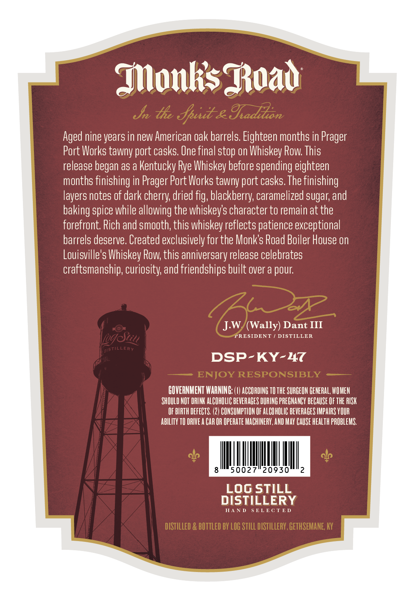
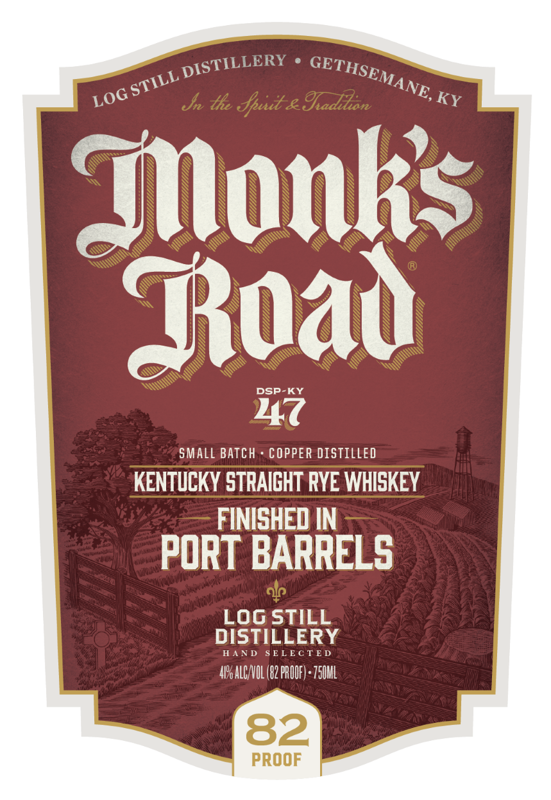

# TTB COLA Label Images - TTBID 26229001000443

**Brand Name:** MONK'S ROAD

**Fanciful Name:** FINISHED IN PORT BARRELS

**Issue Date:** 09/25/2026

**Origin Code:** 22

**Product Class/Type:** 102

**Source:** [TTB Public COLA Registry](https://ttbonline.gov/colasonline/viewColaDetails.do?action=publicFormDisplay&ttbid=26229001000443)

## Label Images

### Back Label

### Front Label

### Label 2

## Extracted Label Text

*Text extracted via OCR - may contain errors*

*1 image(s) excluded: text did not meet readability threshold*

**Detected Proof:** 82

### Back Label

MonksBoad
Jn th Jpui-& Iadion
Aged nine years in new American Oak barrels Eighteen months in
Port Works tawny port casks. Une final stop on Whiskey Row: This
release began as a Kentucky Rye Whiskey before spending eighteen
months finishing in Prager Port Works tawny port casks. The finishing
layers notes of dark cherry; dried fig; blackberry; caramelized sugar; and
baking spice while allowing the whiskeys character to remain at the
forefront Rich and smooth; this whiskey reflects patience exceptional
barrels deserve. Created exclusively for the Monks Road Boiler House on
Louisville's Whiskey Row; this anniversary release celebrates
craftsmanship, curiosity; and friendships built over a pour
J.W (Wally) Dant III
log zu
PRESIDENT
DISTILLER
ERY
DSP-KY-47
ENJOY RESPONSIBLY
GOVERNMENT WARNING: (I) ACCORDING TOthE SURGEON GENERAL, WOMEN
SHOULD NOT DRINK ALCOHOLIC BEVERAGES DURING PREGNANCY BECaUSE OF THE RISK
OF BIRTH DEFECTS: (2) CONSUMPTLON OF ALCOHOLIC BEVERAGES IMPAIRS YOUR
AbILIty TO DRIVE A CAR OR OpErate MACHINERY,AND MaY CAUSe health PROBLEMS.
50027
20930
2
Log STILL
DISTILLERY
HA N D
5 ELECTED
DISTILLED & BOTTLED BY LOG STILL DISTILLERY , GETHSEMANE, KY
Prager
DistilLi

### Front Label

Jn tle Jpud & Iadilton
KY
Monkis
Tuad
DSP-KY
47
SMALL BATCH
COPPER DISTILLED
KENTUCKY STRAIGHT RYE WHISKEY
FINISHED IN
PORT BARRELS
Log STILL
DISTILLERY
HAND
ELECTED
41P_ ALCNOL (82 PROOF) : Z50ML
82
PROOF
DISTILLERY
GETHSEMANE,
STILL _
LOG
Opau|
Mua an
