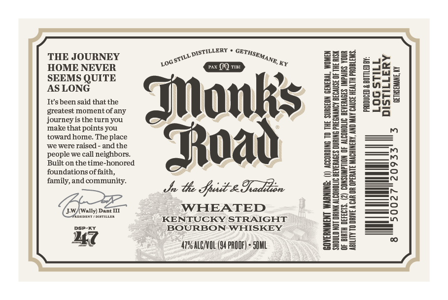

# TTB COLA Label Images - TTBID 26229001000453

**Brand Name:** MONK'S ROAD

**Issue Date:** 08/31/2026

**Origin Code:** 22

**Product Class/Type:** 101

**Source:** [TTB Public COLA Registry](https://ttbonline.gov/colasonline/viewColaDetails.do?action=publicFormDisplay&ttbid=26229001000453)

## Label Images

### Label 1

## Extracted Label Text

*Text extracted via OCR - may contain errors*

**Detected Proof:** 94

### Label 1

LERY
THE JOURNEY
2
LOG
KX
HOME NEVER
JR TID
SBEISQ
Mnls
1
lmp
Itsbeen said that the
greatest momentof any
journey is the turn you
that
you
toward home. The place
we were raised
andthe
Toad
people we call neighbors_
Built on the time-honored
foundations of faith,
family,and community.
th Jpit-egadlon
JW (Wally) Dant III
WHEATED
WEATDAHT
DGTILLNA
KENTUCKY STRAIGHT
DSp-KT
BOURBON
WHISKEY
27
479 AllnuL (94 PROOF) - 5UML
DISTILE
GETHSEMANE;
STILLE
QUITE
make
points -
