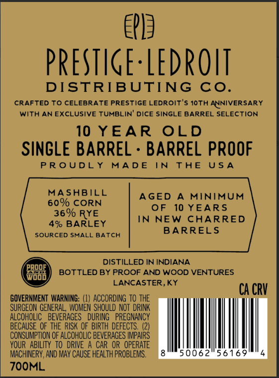
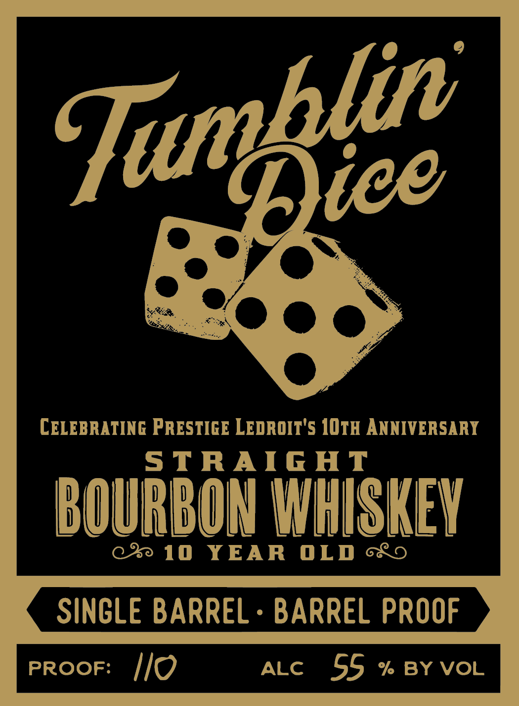

# TTB COLA Label Images - TTBID 26229001000461

**Brand Name:** TUMBLIN DICE

**Issue Date:** 08/25/2026

**Origin Code:** 22

**Product Class/Type:** 101

**Source:** [TTB Public COLA Registry](https://ttbonline.gov/colasonline/viewColaDetails.do?action=publicFormDisplay&ttbid=26229001000461)

## Label Images

### Back Label

### Front Label

## Extracted Label Text

*Text extracted via OCR - may contain errors*

**Detected Age:** 10 Years

### Back Label

te

PRESTIGE-LEDROIT

DISTRIBUTING CO.

CRAFTED TO CELEBRATE PRESTIGE LEDROIT'S 10TH ANNIVERSARY

WITH AN EXCLUSIVE TUMBLIN' DICE SINGLE BARREL SELECTION

10 YEAR OLD

SINGLE BARREL - BARREL PROOF

PROUDLY MADE

IN THE USA

MASHBILL

60% CORN

AGED A MINIMUM

OF 10 YEARS

36% RYE

IN NEW CHARRED

4% BARLEY

BARRELS

SOURCED SMALL BATCH

oF

DISTILLED IN INDIANA,

BOTTLED BY PROOF AND WOOD VENTURES

LANCASTER, KY

CACRY

GOVERNMENT WARNING: (1) ACCORDING TO THE

SURGEON GENERAL, WOMEN SHOULD NOT DRINK

ALCOHOLIC BEVERAGES DURING PREGNANCY

BECAUSE OF THE RISK OF BIRTH DEFECTS. (2)

CONSUMPTION OF ALCOHOLIC BEVERAGES IMPAIRS

YOUR ABILITY TO DRIVE A CAR OR OPERATE

MACHINERY, AND MAY CAUSE HEALTH PROBLEMS.

7OOML

### Front Label

CELEBRATING PRESTIGE LEDROIT'S IOTH ANNIVERSARY
5TRAIG HT
BOURBON WHISKEV
10
YEAR
OLD
SINCLE BARREL
BARREL PROOF
PROOF:
Ilo
ALC
55
% BY VOL
Tumblie
