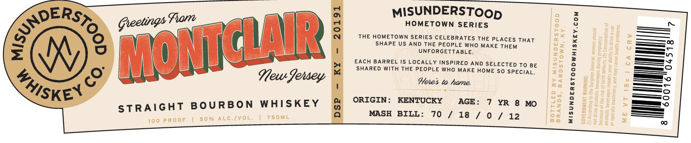

# TTB COLA Label Images - TTBID 26229001000465

**Brand Name:** MISUNDERSTOOD WHISKEY CO.

**Issue Date:** 08/24/2026

**Origin Code:** 22

**Product Class/Type:** 101

**Source:** [TTB Public COLA Registry](https://ttbonline.gov/colasonline/viewColaDetails.do?action=publicFormDisplay&ttbid=26229001000465)

## Label Images

### Label 1

### Label 2

## Extracted Label Text

*Text extracted via OCR - may contain errors*

**Detected Age:** 7 Years

### Label 1

DERS.

MISUNDERSTOop

Greetings Fram

fol

HOMETOWN SERIES

=——

i\

i

THE HOMETOWN SERIES CELEBRATES THE PLACES THAT

SHAPE US AND THE PEOPLE WHO MAKE THEM

[= hed

C

Ll

UNFORGETTABLE.

=—-

NW

ies

_—_—~

————",)

WW

EACH BARREL IS LOCALLY INSPIRED AND SELECTED To BE

oy

UJ

SHARED WITH THE PEOPLE WHO MAKE HOME SO SPECIAL.

—_O

Yeu femey ™

Heres to hame,

_——_ 8)

—=o

1S

KEN

ORIGIN: KENTUCKY

—=o

AGE: 7 YR 8 MO

-——— Bo)

STRAIGHT BOURBON WHISKEY

>

MASH BILL: 70 / 18 / 0 fp ale)

### Label 2

Gocally Selected by
RETAILERS NAME HERE
