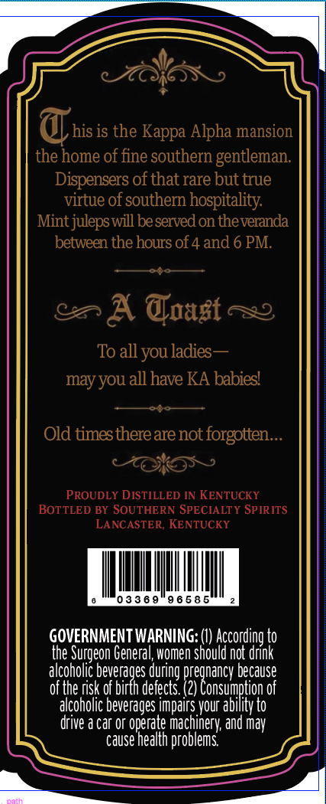
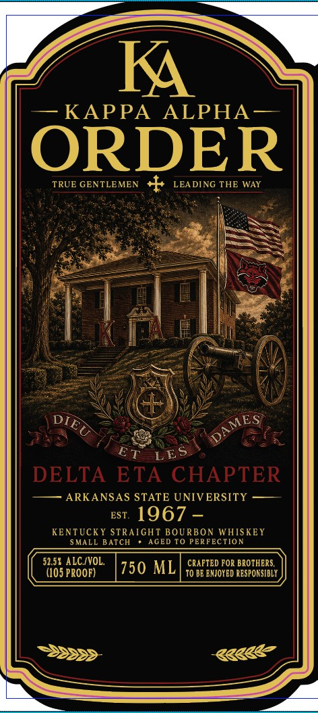

# TTB COLA Label Images - TTBID 26229001000467

**Brand Name:** KA

**Issue Date:** 09/02/2026

**Origin Code:** 22

**Product Class/Type:** 101

**Source:** [TTB Public COLA Registry](https://ttbonline.gov/colasonline/viewColaDetails.do?action=publicFormDisplay&ttbid=26229001000467)

## Label Images

### Back Label

### Front Label

## Extracted Label Text

*Text extracted via OCR - may contain errors*

**Detected Proof:** 105

### Back Label

his is the Kappa Alpha mansion
the home of fine southern gentleman
Dispensers ofthat rare but true
virtue of southern hospitality
Mint juleps will beserved on theveranda
between the hours of 4 and 6 PM.
A @oast
To all you ladies
may you all have KA babies'
Old times there are not forgotten
PROUDLY DISTILLED IN KENTUCKY
BOTTLED BY SOUTHERN SPECIALTY SPIRITS
LANCASTER, KENTUCKY
033 6 9
9 6 5 8 5
GOVERNMENT WARNING:
According to
the Surgeon Genera
women should not drink
alcoholic beverages during pregnancy because
of the risk of birth defects. (2) Consumption of
alcoholic beverages impairs your ability to
drive a Car or operate mac
and may
cause health
lems
achinery;
proble

### Front Label

K
KAPPA
ALPHA-
ORDER
TRUE GENTLEMEN
+
LEA DING THE WAY
DELTA
ETA CHAPTER
ARKANSAS STATE UNIVERSITY
EST.
1967
KENTUCKY
STRAIGHT BOURBON WHISKEY
SMALL
ATCH
AGED TO PERFECTION
52,58 ALC/VOL.
CRAFTED FOR BROTHERS,
(105 PROOF)
750 ML
T0 BE ENTOYED RESPONSIBLY
DIEU
DAMES
ET
LES
k8888
