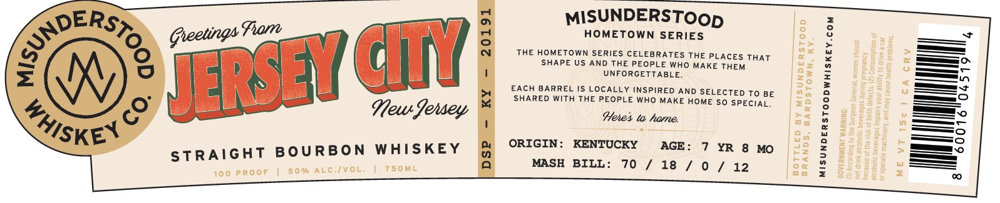

# TTB COLA Label Images - TTBID 26229001000471

**Brand Name:** MISUNDERSTOOD WHISKEY CO.

**Issue Date:** 08/24/2026

**Origin Code:** 22

**Product Class/Type:** 101

**Source:** [TTB Public COLA Registry](https://ttbonline.gov/colasonline/viewColaDetails.do?action=publicFormDisplay&ttbid=26229001000471)

## Label Images

### Label 1

### Label 2

## Extracted Label Text

*Text extracted via OCR - may contain errors*

**Detected Age:** 7 Years

### Label 1

MISUNDERSTOop

HOMETOWN SERIES

THE HOMETOWN SERIES CELEBRATES THE PLACES THAT
SHAPE US AND THE PEOPLE WHO MAKE THEM
UNFORGETTABLE.

EACH BARREL IS LOCALLY INSPIRED AND SELECTED To BE
SHARED WITH THE PEOPLE WHO MAKE HOME SO SPECIAL.

Heres to home,

ORIGIN: KENTUCKY AGE: 7 YR 8 MO
MASH BILL: 70 / 18 / 0 yf ale)

MISUNDERSTOODWHISKEY.coM

### Label 2

Gocally Selected by
RETAILERS NAME HERE
