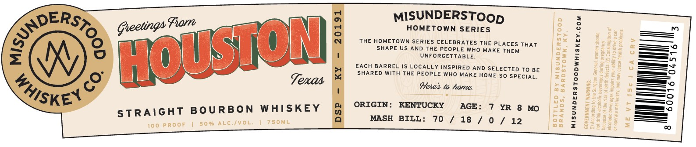

# TTB COLA Label Images - TTBID 26229001000479

**Brand Name:** MISUNDERSTOOD WHISKEY CO.

**Issue Date:** 08/24/2026

**Origin Code:** 22

**Product Class/Type:** 101

**Source:** [TTB Public COLA Registry](https://ttbonline.gov/colasonline/viewColaDetails.do?action=publicFormDisplay&ttbid=26229001000479)

## Label Images

### Label 1

### Label 2

## Extracted Label Text

*Text extracted via OCR - may contain errors*

**Detected Age:** 7 Years

### Label 1

MISUNDERSTOop

ERS»

Greetings Fam

HOMETOWN SERIES

—~

>>>

CU

THE HOMETOWN SERIES CELEBRATES THE PLACES THAT

i

SHAPE US AND THE PEOPLE WHO MAKE THEM

UNFORGETTABLE.

=—-

»

——_7)

“4

EACH BARREL IS LOCALLY INSPIRED AND SELECTED To BE

_—_—~

oy

[)

ae

SHARED WITH THE PEOPLE WHO MAKE HOME SO SPECIAL.

—_O

Texas

Here’ to tame,

—-

[—__

—S=o

/§

KEN

—=o

ORIGIN: KENTUCKY

AGE: 7 YR 8 MO

STRAIGHT BOURBON WHISKEY

>

MASH BILL: 70 / 18 / 0 / 12

### Label 2

Gocally Selected by
RETAILERS NAME HERE
