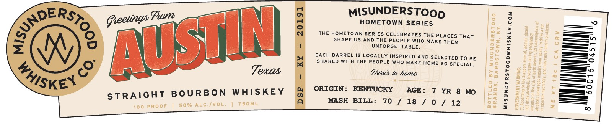

# TTB COLA Label Images - TTBID 26229001000484

**Brand Name:** MISUNDERSTOOD WHISKEY CO.

**Issue Date:** 09/15/2026

**Origin Code:** 22

**Product Class/Type:** 101

**Source:** [TTB Public COLA Registry](https://ttbonline.gov/colasonline/viewColaDetails.do?action=publicFormDisplay&ttbid=26229001000484)

## Label Images

### Label 1

### Label 2

## Extracted Label Text

*Text extracted via OCR - may contain errors*

**Detected Age:** 7 Years

### Label 1

pERS.

ootings Fiore

MISUNDERSTOop

HOMETOWN SERIES

=—

THE HOMETOWN SERIES CELEBRATES THE PLACES THAT

=—=n

—,

SHAPE US AND THE PEOPLE WHO MAKE THEM

UNFORGETTABLE.

=—-

=

gl

EACH BARREL IS LOCALLY INSPIRED AND SELECTED To BE

_—~

%

SHARED WITH THE PEOPLE WHO MAKE HOME SO SPECIAL.

—_O

roy

UD

Texas

Petes to hame.

1S

KEN

ORIGIN: KENTUCKY AGE: 7 YR 8 MO

—=ao

STRAIGHT BOURBON WHISKEY

-———

-——— Bo)

MASH BILL: 70 / 18 / 0 / 12

>=

### Label 2

Gocally Selected by
RETAILERS NAME HERE
