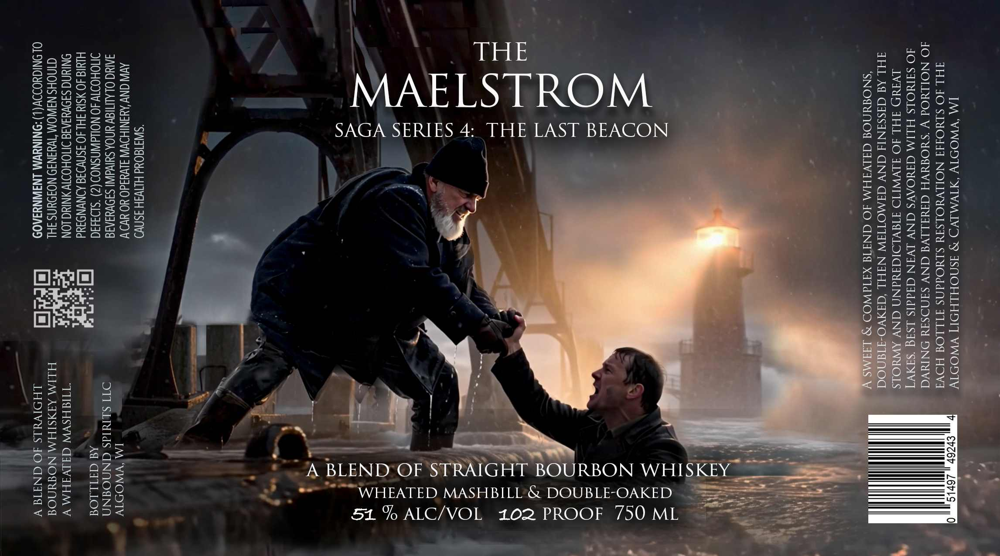

# TTB COLA Label Images - TTBID 26229001000514

**Brand Name:** THE MAELSTROM

**Fanciful Name:** SAGA SERIES 4: THE LAST BEACON

**Issue Date:** 08/24/2026

**Origin Code:** 48

**Product Class/Type:** 121

**Source:** [TTB Public COLA Registry](https://ttbonline.gov/colasonline/viewColaDetails.do?action=publicFormDisplay&ttbid=26229001000514)

## Label Images

### Label 1

## Extracted Label Text

*Text extracted via OCR - may contain errors*

**Detected Proof:** 102

### Label 1

IM ‘VWODTY ATVM.LYD °9 ISQNOHLHDIT VYWODTY

FHL JO SIWOAIT NOLLVYOLSTY SLYOddNS TILLOW HOV:
JO NOLLMOd VY ‘SYOMIVH AIWILLVG ANV SINDSTY ONN
JO SAMWOLS HLIM GIWOAVS CNV IVAN Gdddls LS

THE

ELSTROM

MA

SAGA SERIES 4: THE LAST BEACON

“SIWI180Ud HIVSH ASNWO

AVIN CNY AYSNIHOWIN JIWead0 YO UvO
AAU OLALIIEY UNDA SHIVA SADVYIAIE
INOHODIV 40 NOLAWNSNOD (2) *S1934340
HIu1a 40 YSIY SHL4O ASNVIIE AONVNDSUd
ONINNG SADVYIAIS INOHOII ANINCLON
INOHS N3NOM ‘TWa3N39 NOJOUNS FHL
OLONIGYODOV(L)ONINYWM LNIWNYIA09

OF ded

- ve

.. A BLEND ‘OF §
521% ALC/VOL 102 PROOF 750 ML

_ == """"WHEATED MASHBILL’& DOUBLE-OAKED =

:
.
>
=)
“~e

fe a ~

'
IM ‘YWODI1V
OT] SLIMIds GNNO@INN
AW GITLLOG

“TIIAHSWW Ga IVIHM V
HLIM AIASIHM NO@NOF
LHOIWYLS " NM
