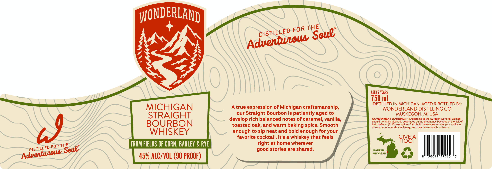

# TTB COLA Label Images - TTBID 26229001000652

**Brand Name:** WONDERLAND

**Issue Date:** 09/02/2026

**Origin Code:** 06

**Product Class/Type:** 101

**Source:** [TTB Public COLA Registry](https://ttbonline.gov/colasonline/viewColaDetails.do?action=publicFormDisplay&ttbid=26229001000652)

## Label Images

### Label 1

## Extracted Label Text

*Text extracted via OCR - may contain errors*

**Detected Proof:** 90
**Detected Age:** 2 Years

### Label 1

WONDERLAND
ACED 2 YEARS
750 ml
DISTILLED IN MICHIGAN, AGED & BOTTLED BY:
MICHIGAN
true expression of Michigan craftsmanship,
WONDERLAND DISTILLING CO.
STRAIGHT
our
Straight Bourbon is patiently aged to
MUSKEGON, MI USA
develop rich balanced notes of caramel, vanilla,
GOVERNMENT WARNING: (1) According to the Surgeon General, women
BOURBON
should not drink alcoholic beverages during pregnancy because of the risk of
toasted oak, and warm baking spice: Smooth
birth defects. (2) Consumption of alcoholic beverages impairs your ability to
n9
drive
car or operate machinery; and may cause health problems
WHISKEY
enough to sip neat and bold enough for your
favorite cocktail, it's a whiskey that feels
GIVE .
9I85F
FROM FIELDS OF CORN; BarLEY & RYe
right at home wherever
good stories are shared.
MADE IN
MICHIGAN
45V ALC/VOL (90 PROOF)
THE
FOR
DISTiLLED
Seue;
Adventiaus
THE
FOR
DISTiLLED
Soue"
Adventeow
