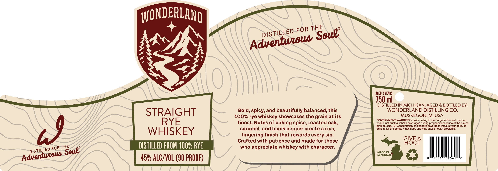

# TTB COLA Label Images - TTBID 26229001000688

**Brand Name:** WONDERLAND

**Issue Date:** 08/25/2026

**Origin Code:** 06

**Product Class/Type:** 102

**Source:** [TTB Public COLA Registry](https://ttbonline.gov/colasonline/viewColaDetails.do?action=publicFormDisplay&ttbid=26229001000688)

## Label Images

### Label 1

## Extracted Label Text

*Text extracted via OCR - may contain errors*

**Detected Proof:** 90
**Detected Age:** 2 Years

### Label 1

WONDERLAND

DISTILLED FOR Nooul

A

AGED 2 YEARS

DISTILLED IN MICHIGAN, AGED & BOTTLED BY:

Bold, spicy, and beautifully balanced, this

WONDERLAND DISTILLING CO

STRAIGHT

100% rye whiskey showcases the grain at its

MUSKEGON, MI USA

should not drink alcoholic beverages during pregnancy because of the risk of

GOVERNMENT WARNING: (1) According to the Surgeon General, women

RYE

finest. Notes of baking spice, toasted oak,

birth defects. (2) Consumption of alcoholic beverages impairs your ability to

caramel, and black pepper create a rich

drive a car or operate machinery, and may cause health problems.

WHISKEY

lingering finish that rewards every sip

Crafted with patience and made for those

Givae

DISTILLED FROM 100% RYE

who appreciate whiskey with character

>. 5

pISTILLED-FOR soul

MADE IN

MICHIGAN

ye

50041°59561

i

|

l

45% ALC/VOL (90 PROOF)
