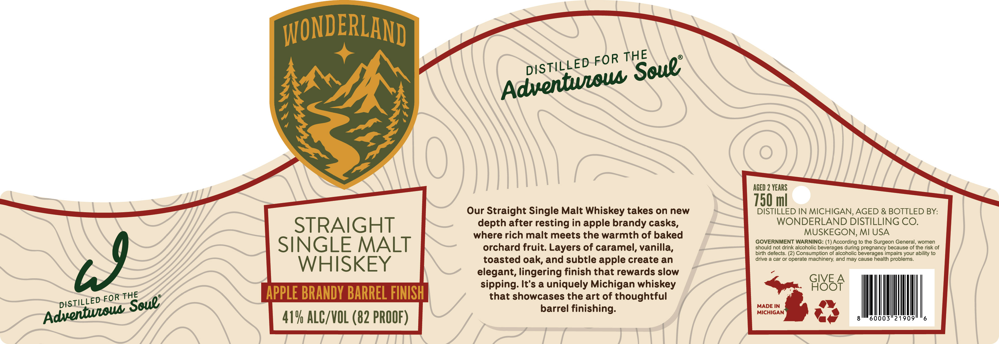

# TTB COLA Label Images - TTBID 26229001000689

**Brand Name:** WONDERLAND

**Issue Date:** 08/26/2026

**Origin Code:** 06

**Product Class/Type:** 117

**Source:** [TTB Public COLA Registry](https://ttbonline.gov/colasonline/viewColaDetails.do?action=publicFormDisplay&ttbid=26229001000689)

## Label Images

### Label 1

## Extracted Label Text

*Text extracted via OCR - may contain errors*

**Detected Proof:** 82
**Detected Age:** 2 Years

### Label 1

WONDERLAND
AGED 2 YEARS
750 ml
Our Straight Single Malt Whiskey takes on new
DISTILLED IN MICHIGAN, AGED & BOTTLED BY:
STRAIGHT
depth after resting in apple brandy casks,
WONDERLAND DISTILLING CO.
where rich malt meets the warmth of baked
MUSKEGON; MI USA
SINGLE MALT
GOVERNMENT WARNING: (1) According to the Surgeon General, women
orchard fruit: Layers of caramel, vanilla,
should not drink alcoholic beverages during pregnancy because of the risk of
birth defects. (2) Consumption of alcoholic beverages impairs your ability to
toasted oak, and subtle apple create an
drive
car Or operate machinery; and may cause health problems_
WHISKEY
elegant, lingering finish that rewards slow
sipping: It'$ a uniquely Michigan whiskey
98SF
THE
APPLE BRANDY BARREL FINISH
that showcases the art of thoughtful
barrel finishing:
MADE IN
MICHIGAN
41% ALC/VOL (82 PROOF)
60003"21909
THE
FOR
Scue"
DISTiLLED
Adventwwous
79
DISTiLLED FOR
Soue"
Adventueous
