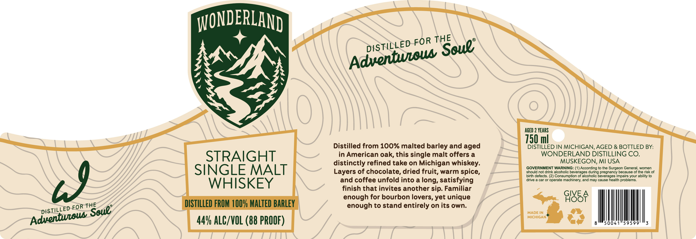

# TTB COLA Label Images - TTBID 26229001000690

**Brand Name:** WONDERLAND

**Issue Date:** 08/26/2026

**Origin Code:** 06

**Product Class/Type:** 117

**Source:** [TTB Public COLA Registry](https://ttbonline.gov/colasonline/viewColaDetails.do?action=publicFormDisplay&ttbid=26229001000690)

## Label Images

### Label 1

## Extracted Label Text

*Text extracted via OCR - may contain errors*

**Detected Proof:** 88
**Detected Age:** 2 Years

### Label 1

WONDERLAND
AGED 2 YEARS
750 ml
Distilled from 100% malted barley and aged
DISTILLED IN MICHIGAN AGED & BOTTLED BY:
STRAIGHT
in American oak, this single malt offers a
WONDERLAND DISTILLING CO.
distinctly refined take on Michigan whiskey:
MUSKEGON; MI USA
SINGLE MALT
GOVERNMENT WARNING: (1) According to the Surgeon General, women
Layers of chocolate, dried fruit, warm spice,
should not drink alcoholic beverages during pregnancy because of the risk of
birth defects. (2) Consumption of alcoholic beverages impairs your ability to
and coffee unfold into a long, satisfying
drive
car or operate machinery; and may cause health problems_
WHISKEY
finish that invites another sip. Familiar
enough for bourbon lovers, yet unique
98EF
THE
DISTILLED FROM 1 QO% MALTED BARLEY
enough to stand entirely on its own:
MADE IN
MIcHIGAN
449 ALC/VOL (88 PROOF)
50041
59599
3
THE
FOR
Soue"
DISTiLLED
Adventwtows
39
DISTiLLED FOR
Soue"
Adventueous
