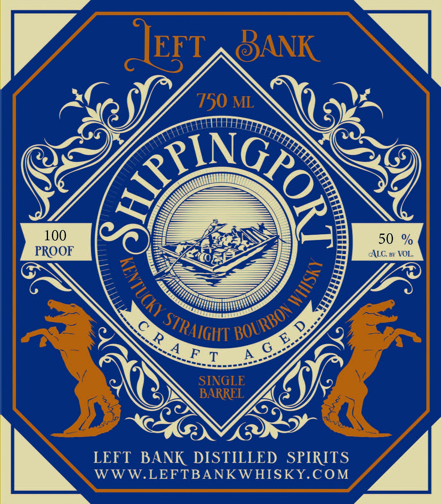
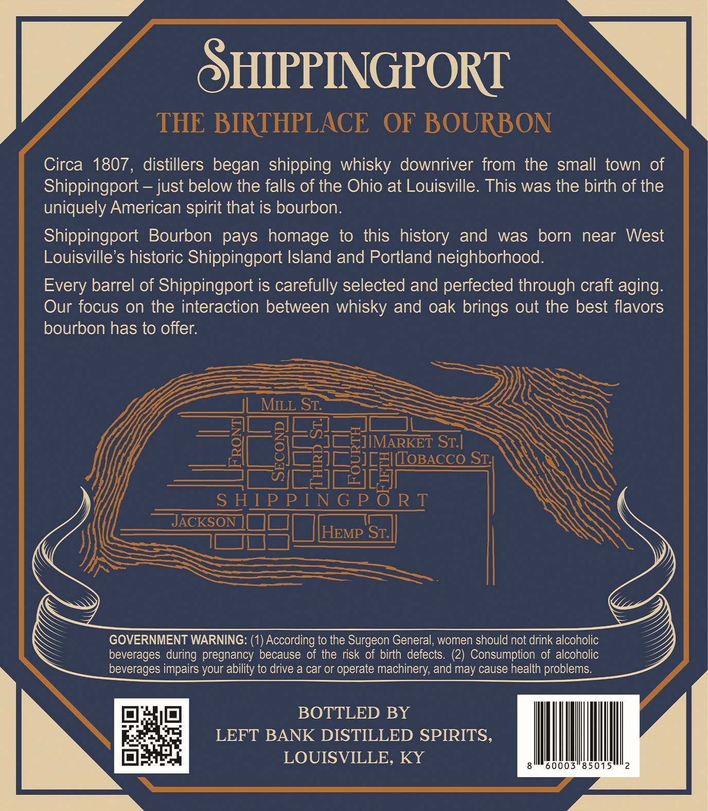

# TTB COLA Label Images - TTBID 26229001000718

**Brand Name:** LEFT BANK

**Fanciful Name:** SHIPPINGPORT STRAIGHT BOURBON WHISKY

**Issue Date:** 08/25/2026

**Origin Code:** 22

**Product Class/Type:** 101

**Source:** [TTB Public COLA Registry](https://ttbonline.gov/colasonline/viewColaDetails.do?action=publicFormDisplay&ttbid=26229001000718)

## Label Images

### Label 1

### Label 2

## Extracted Label Text

*Text extracted via OCR - may contain errors*

**Detected Proof:** 100

### Label 1

EFT
8ANK
750 ML
100
L9A
50
PROOF
ALC: By VOL.
F
T
A
SINGLE
BARREL
LEFT
BANK DISTILLED
SPIRITS
WWW.LEFTBANKWHISKY.COM
1
1
BOURBON
STRAIGHT
G_E
R A

### Label 2

SHPPINGPORT
THE BIRTHPLACE
OF BOURBON
Circa 1807, distillers began  shipping whisky downriver from the small town of
Shippingport
just below the falls of the Ohio at Louisville. This was the birth of the
uniquely American spirit that is bourbon:
Shippingport
Bourbon pays homage
to this history and
was
born
near
West
Louisville's historic Shippingport Island and Portland neighborhood.
Every barrel of Shippingport is carefully selected and perfected through craft aging:
Our focus on the interaction between whisky and oak brings out the best flavors
bourbon has to offer:
MILL St:
ST: |
8
Egiiona8co
STI
5
2IcEI
S HIP P I N G P 0 R T
JACKSON
HEMP Sc
GOVERNMENT WARNING:
According to the Surgeon General; women should not drink alcoholic
beverages during pregnancy because of the risk of birth defects. (2) Consumption of alcoholic
beverages impairs your ability to drive a car or operate machinery; and may cause health problems:
BOTTLED BY
LEFT BANK DISTILLED SPIRITS,
LOUISVILLE, KY
60003"85015
