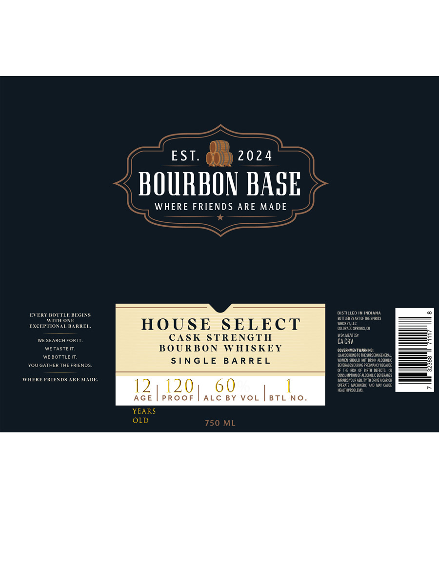

# TTB COLA Label Images - TTBID 26229001000724

**Brand Name:** BOURBON BASE

**Fanciful Name:** HOUSE SELECT

**Issue Date:** 08/27/2026

**Origin Code:** 13

**Product Class/Type:** 141

**Source:** [TTB Public COLA Registry](https://ttbonline.gov/colasonline/viewColaDetails.do?action=publicFormDisplay&ttbid=26229001000724)

## Label Images

### Label 1

## Extracted Label Text

*Text extracted via OCR - may contain errors*

### Label 1

EST.
2024
BOURBON BASE
WHERE FRIENDS ARE MADE
distilLEd IM IdianI
LTEKT BOTTu MGNS
OeneIaTneIeePItS
WTIOAT
ECTtom#KREL
HO USE
SELECT
Mle
COUCKFDO SFeigs @
CASK STRENG T H
HSWiy
WE SeaRchFORiT,
CA CRV
TASTEIT,
BOURBON
W HIS KEY
COVERMMEMTWIGNNG
~Macolobo"SI0IFE SUEGEONGE'EpEL
We bottleit;
SING LE
B A R R E L
KcV" sholld RvI de aoctulc
YoUGATHER THE FRIENDS
BmEEMeSeR NUEDMCEI
HPTH  DEFECTS
ounsuupiuxutalchulebaalt:
WIEREFRIEIDSAKEMADE.
NFAES Mqup aelIt T0 draciue
12
120
6 0
CPFRXTE WcaIRL Und MCi
HEALTHP CALEE
AGE
PRO0F
ALC BY VoL
BTL No
YEARS
OLD
750 ML
