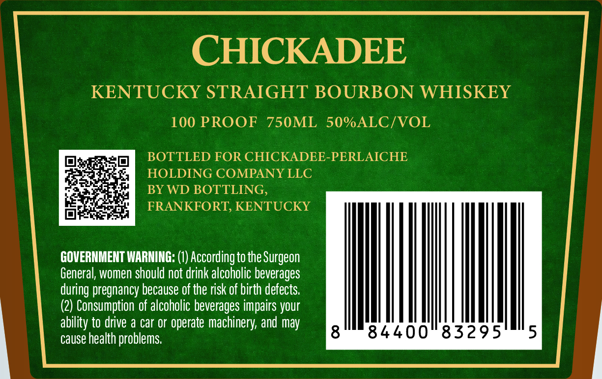
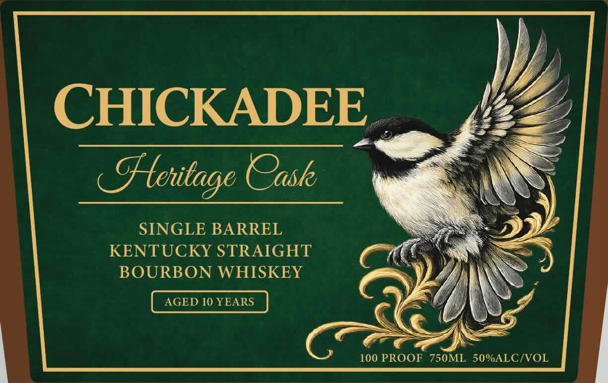
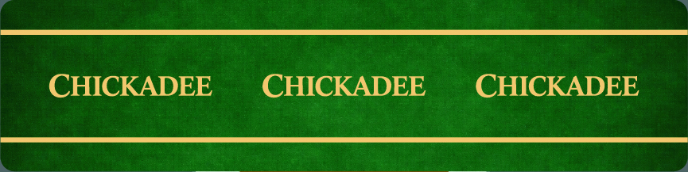

# TTB COLA Label Images - TTBID 26230001000103

**Brand Name:** CHICADEE

**Fanciful Name:** SINGLE BARREL STRAIGHT BOURBON WHISKEY

**Issue Date:** 08/25/2026

**Origin Code:** 22

**Product Class/Type:** 101

**Source:** [TTB Public COLA Registry](https://ttbonline.gov/colasonline/viewColaDetails.do?action=publicFormDisplay&ttbid=26230001000103)

## Label Images

### Back Label

### Front Label

### Label 3

## Extracted Label Text

*Text extracted via OCR - may contain errors*

*1 image(s) excluded: text did not meet readability threshold*

**Detected Proof:** 100
**Detected Age:** 10 Years

### Back Label

CHICKADEE
KENTUCKY STRAIGHT BOURBON WHISKEY
100 PROOF
750ML
50%ALC/VOL
BOTTLED FOR CHICKADEE-PERLAICHE
HOLDING COMPANY LLC
BY WD BOTTLING,
FRANKFORT; KENTUCKY
GOVERNMENT WARNING: (1) According to the Surgeon
General, women should not drink alcoholic beverages
during pregnancy because of the risk of birth defects:
(2) Consumption of alcoholic beverages impairs your
ability to drive a car or operate machinery; and may
cause health problems

### Front Label

CHICKADEE .
—Kentage Case Crash

SINGLE BARREL
KENTUCKY STRAIGHT
BOURBON WHISKEY

AGED 10 YEARS

100 PROOF 750ML 50%ALC/VOL
