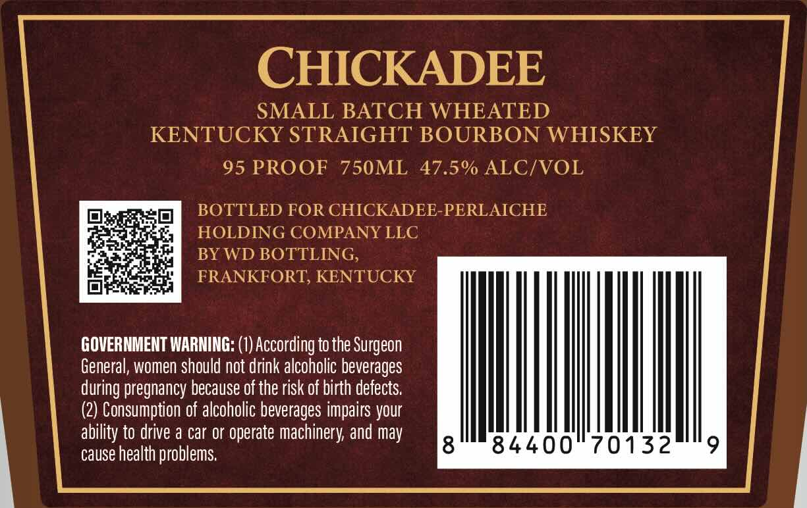
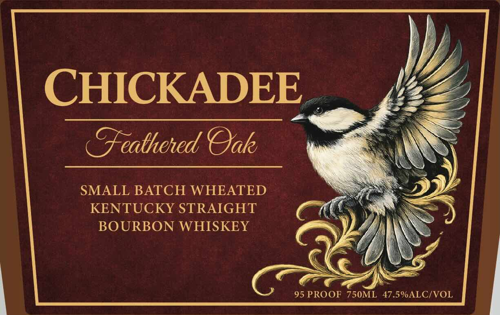
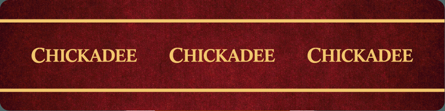

# TTB COLA Label Images - TTBID 26230001000105

**Brand Name:** CHICKADEE

**Fanciful Name:** SMALL BATCH WHEATED KENTUCKY STRAIGHT BOURBON WHISKEY

**Issue Date:** 08/31/2026

**Origin Code:** 22

**Product Class/Type:** 101

**Source:** [TTB Public COLA Registry](https://ttbonline.gov/colasonline/viewColaDetails.do?action=publicFormDisplay&ttbid=26230001000105)

## Label Images

### Back Label

### Front Label

### Label 2

## Extracted Label Text

*Text extracted via OCR - may contain errors*

*1 image(s) excluded: text did not meet readability threshold*

**Detected Proof:** 95

### Back Label

CHICKADEE
SMALL BATCH WHEATED
KENTUCKY STRAIGHT BOURBON WHISKEY
95 PROOF
750ML
47.5% ALCIVOL
BOTTLED FOR CHICKADEE-PERLAICHE
HOLDING COMPANY LLC
BY WD BOTTLING,
FRANKFORT; KENTUCKY
GOVERNMENT WARNING: (1) According to the Surgeon
General, women should not drink alcoholic beverages
during pregnancy because of the risk of birth defects:
(2) Consumption of alcoholic beverages impairs your
ability to drive a car or operate machinery and may
cause health problems
8
84400
70132

### Front Label

YY,

y

CHICKADEE

8

Feathered Qak

PS

SMALL BATCH WHEATED

2)

KENTUCKY STRAIGHT

sare

BOURBON WHISKEY

4

mas

95 PROOF on 47.5%ALC/VOL
