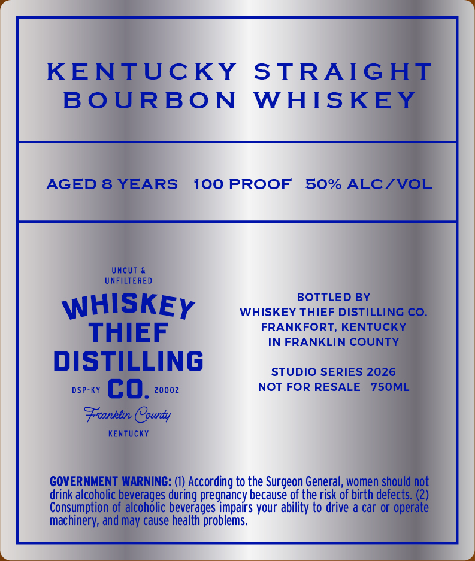
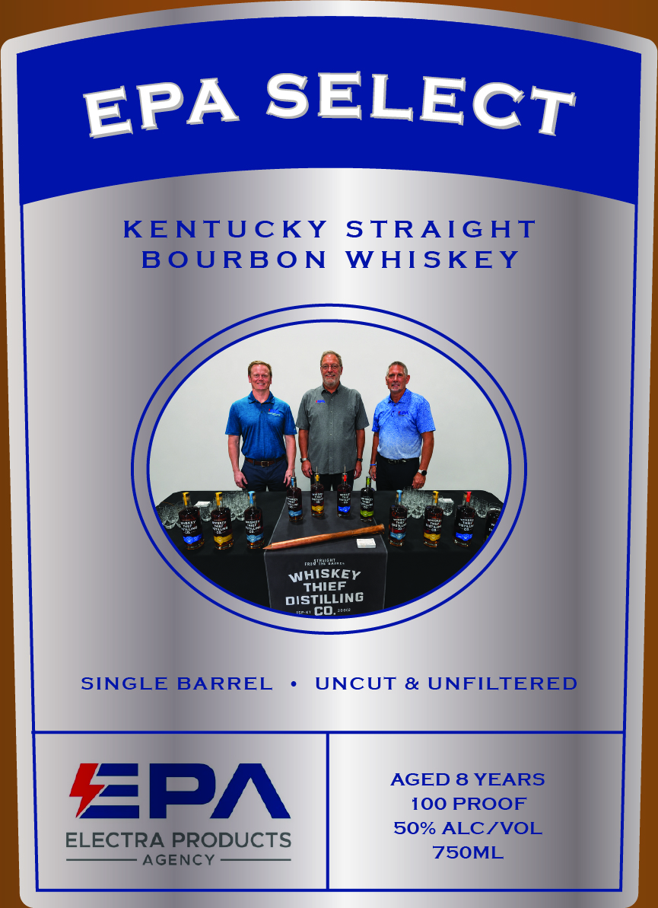

# TTB COLA Label Images - TTBID 26230001000113

**Brand Name:** WHISKEY THIEF DISTILLING CO.

**Fanciful Name:** EPA SELECT

**Issue Date:** 08/28/2026

**Origin Code:** 22

**Product Class/Type:** 101

**Source:** [TTB Public COLA Registry](https://ttbonline.gov/colasonline/viewColaDetails.do?action=publicFormDisplay&ttbid=26230001000113)

## Label Images

### Back Label

### Front Label

## Extracted Label Text

*Text extracted via OCR - may contain errors*

**Detected Proof:** 100
**Detected Age:** 8 Years

### Back Label

KENTUCKY
STRAIGHT
BoURBO N
WHISKEY
AGED 8 YEARS
100 PROOF
50% ALCIVOL
Uncut
UNFILTERED
BOTTLED BY
WHISKEY
WHISKEY THIEF DISTILLING CO.
THIEF
FRANKFORT, KENTUCKY
IN FRANKLIN COUNTY
DISTILLING
STUDIO SERIES 2026
DSP-KY
co.
20002
NOT FOR RESALE
750ML
Franklin County
Kentucky
GOVERNMENT WARNING: (1) According to the Surgeon General, women should not
drink alcoholic beverages during pregnancy because of the risk of birth defects. (2)
Consumption of alcoholic beverages impairs your ability to drive a car or operate
machinery; and may cause health problems.

### Front Label

SELECT
KENTUCKY
STRAIGHT
B0 URB O N
WHISKEY
Jda
WHISKEY
THIEF
DISTILLING
co_
SINGLE
BARREL
UNCUT & UNFILTERED
AGED 8 YEARS
ZPA
100 PROOF
50% ALC/VOL
ELECTRA PRODUCTS
AGENCY
750ML
EPA
