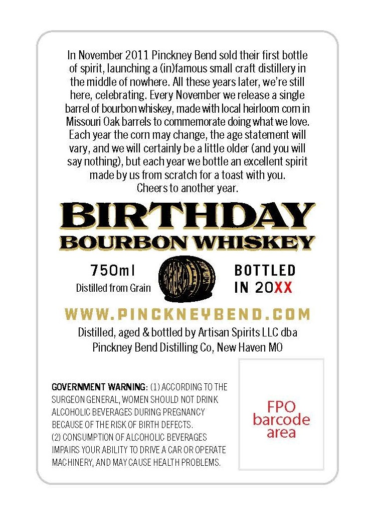
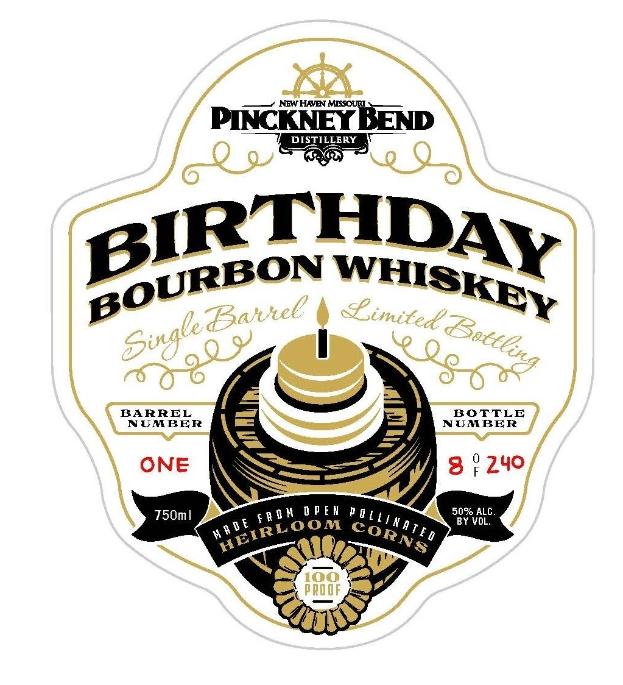

# TTB COLA Label Images - TTBID 26230001000337

**Brand Name:** PINCKNEY BEND

**Fanciful Name:** BIRTHDAY BOURBON

**Issue Date:** 09/03/2026

**Origin Code:** 29

**Product Class/Type:** 141

**Source:** [TTB Public COLA Registry](https://ttbonline.gov/colasonline/viewColaDetails.do?action=publicFormDisplay&ttbid=26230001000337)

## Label Images

### Back Label

### Front Label

## Extracted Label Text

*Text extracted via OCR - may contain errors*

### Back Label

In November 2011 Pinckney Bend sold their first bottle
of spirit, launching a (in)famous small craft distillery in
the middle of nowhere. AIl these years later; we're still
here; celebrating: Every November we release a single
barrel of bourbonwhiskey; made with local heirloom comin
Missouri Oak barrels to commemorate doing whatwe love
Each year the corn may change, the age statement will
vary_
we will certainly be a little older (and you will
say nothing), but eachyear we bottle an excellent spirit
made by us from scratch for a toast with YOU.
Cheersto another year:
BIRTHDAY
BOURBON WHISKEY
750m |
BOTTLED
Distilled from Grain
IN 20XX
WWW.PInCKNEYBEND.COM
Distilled; aged & bottled by Artisan Spirits LLC .
Pinckney Bend Distilling Co; New Haven MO
GOVERNMENT WARNING: (1) ACCORDING TQ THE
SURGEON GENERAL, WOMEN SHQULD NQT DRINK
ALCOHOLIC BEVERAGES DURING PREGNANCY
FPO
BECAUSE OF THE RISK OF BIRTH DEFECTS ,
barcode
CONSUMPTION OFALCOHOLIC BEVERAGES
area
IMPAIRS YOUR ABILITY TQ DRIVE 4 CAR OR OPERATE
MACHINERY, AND MAY CAUSE HEALTH PROBLEMS,
and
dba

### Front Label

_———+ NEWHAVEN MISSOURI 5_—_

PINCKNEY BEND

So

THD

URBON WHIs

we “a nel

Limited? x oe

BARREL

UMBER

ee

ONE

240

pend

eRON OPEN Day,

Q nae

oo
