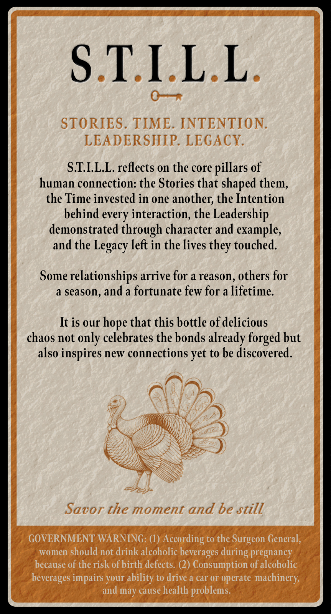
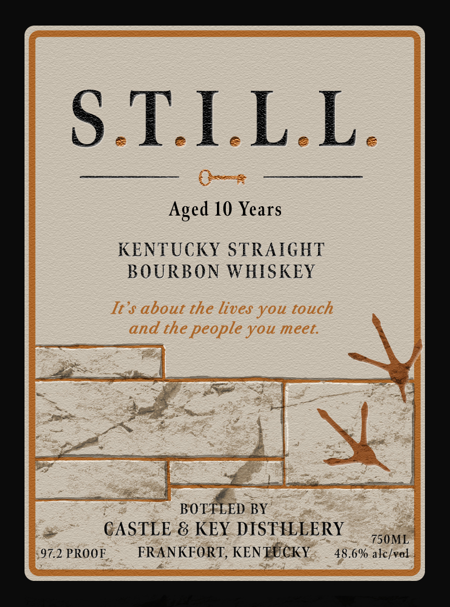

# TTB COLA Label Images - TTBID 26230001000355

**Brand Name:** S.T.I.L.L.

**Issue Date:** 08/27/2026

**Origin Code:** 22

**Product Class/Type:** 101

**Source:** [TTB Public COLA Registry](https://ttbonline.gov/colasonline/viewColaDetails.do?action=publicFormDisplay&ttbid=26230001000355)

## Label Images

### Back Label

### Label 1

## Extracted Label Text

*Text extracted via OCR - may contain errors*

**Detected Proof:** 97.2
**Detected Age:** 10 Years

### Back Label

STILL
STORIES
TIME.
INTENTION.
LEADERSHIP. LEGACY.
S.TILL. reflects on the core pillars of
human connection: the Stories that shaped them,
the Time invested in one another; the Intention
behind every interaction, the Leadership
demonstrated through character and example,
and the Legacy left in the lives
touched
Some
'relationships arrive for a reason , others for
a season, and a fortunate few for a lifetime
It is our
hope that this bottle of delicious
chaos not only celebrates the bonds already forged but
also inspires new connections
to be discovered.
Savor the moment and be still
GOVERNMENT WARNING: (L) According to the Surgeon General;
women should not drink alcoholic
beverages =
pregnancy
because of the risk of birth defects. (2) Consumption of alcoholic
beverages impairs your
to drive a car or operate
machinery;
and may cause health
problems:
they-
yet
during
ability

### Label 1

S.TLLL
Aged 10 Years
KENTUCKY STRAIGHT
BOURBON WHISKEY
It $ about the lives you touch
and the people you meet:
BOTTLED BY
CASTLE & KEY DISTILLERY
750ML
97.2 PROOF
FRANKFORT, KENTUCKY
48.6% alc/vol
