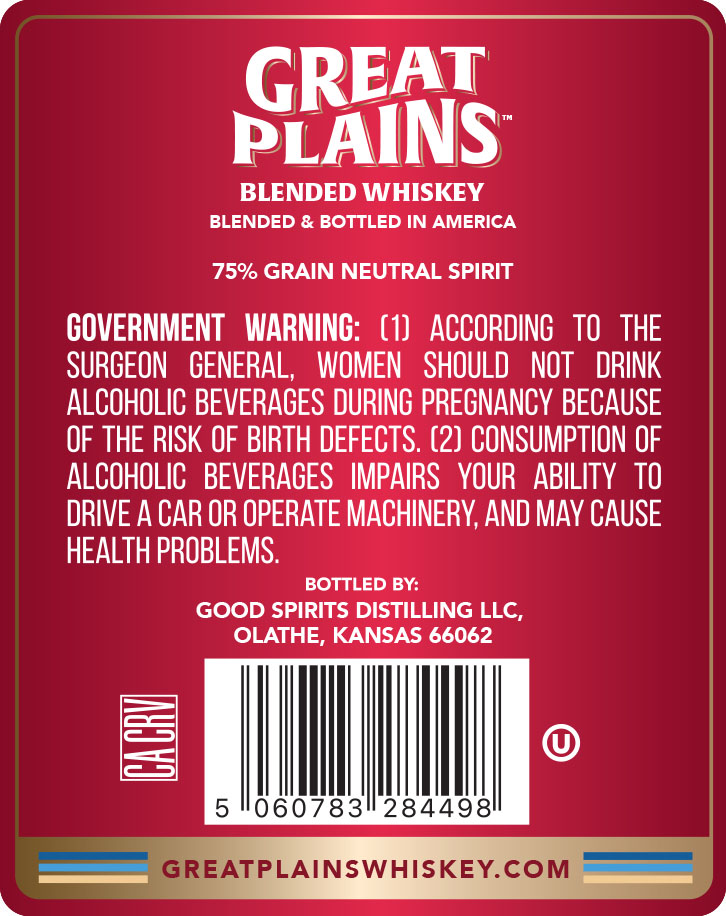
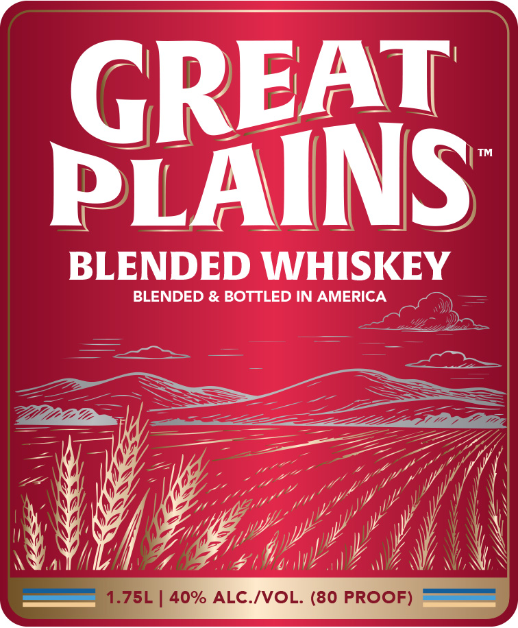

# TTB COLA Label Images - TTBID 26230001000439

**Brand Name:** GREAT PLAINS

**Issue Date:** 08/25/2026

**Origin Code:** 21

**Product Class/Type:** 137

**Source:** [TTB Public COLA Registry](https://ttbonline.gov/colasonline/viewColaDetails.do?action=publicFormDisplay&ttbid=26230001000439)

## Label Images

### Back Label

### Front Label

## Extracted Label Text

*Text extracted via OCR - may contain errors*

*1 image(s) excluded: text did not meet readability threshold*

### Back Label

GREAT
PLAINS
BLENDED WHISKEY
BLENDED & BOTTLED IN AMERICA
75% GRAIN NEUTRAL SPIRIT
COVERNMENT   WARNINC:   (1)  ACCORDING   TO   THE
SURGEON
GENERAL,
WOMEN   SHOULD   NOT
DRINK
ALCOHOLIC BEVERAGES DURING PREGNANCY BECAUSE
OF THE RISK OF BIRTH DEFECTS: (2) CONSUMPTION OF
ALCOHOLIC   BEVERAGES   IMPAIRS   YOUR   ABILITY  TO
DRIVE A CAR OR OPERATE MACHINERY; AND MAY CAUSE
HEALTH PROBLEMS.
BOTTLED BY:
GOOD SPIRITS DISTILLING LLC,
OLATHE, KANSAS 66062
B
5 1060783
284498
GREATPLAINSWHISKEY.COM
