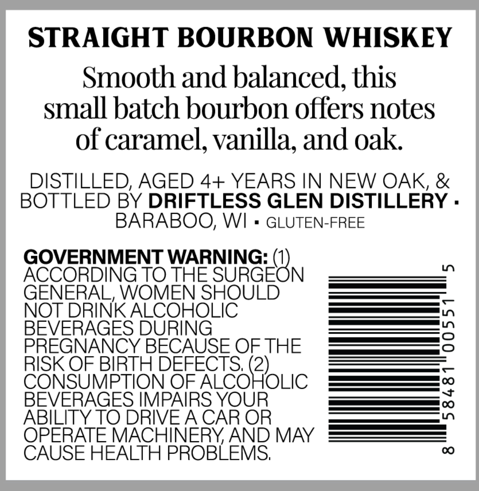
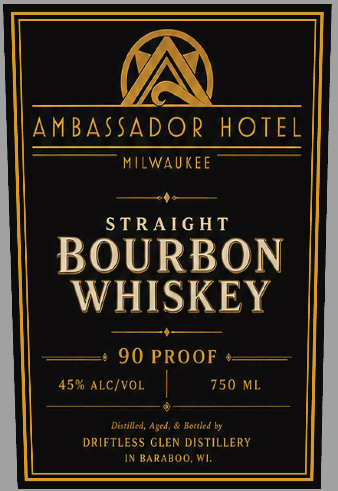

# TTB COLA Label Images - TTBID 26230001000518

**Brand Name:** AMBASSADOR HOTEL

**Issue Date:** 08/28/2026

**Origin Code:** 48

**Product Class/Type:** 101

**Source:** [TTB Public COLA Registry](https://ttbonline.gov/colasonline/viewColaDetails.do?action=publicFormDisplay&ttbid=26230001000518)

## Label Images

### Back Label

### Front Label

## Extracted Label Text

*Text extracted via OCR - may contain errors*

**Detected Proof:** 90

### Back Label

STRAIGHT BOURBON WHISKEY
Smooth and balanced, this
small batch bourbon offers notes
of caramel, vanilla; and oak
DISTILLED; AGED 4+ YEARS IN NEW OAK, &
BOTTLED BY DRIFTLESS GLEN DISTILLERY .
BARABOO; WI
GLUTEN-FREE
GOVERNMENT WARNING:
ACCORDING TO THE
SUHGEBN
L
GENERAL, WOMEN SHOULD
NOT DRINK ALCOHOLIC
BEVERAGES DURING
3
PREGNANCY BECAUSE OF THE
RISK OF BIRTH DEFECTS; (2)
CONSUMPTION OF ALCOHOLIC
BEVERAGES IMPAIRS YOUR
3
ABILITY TO DRIVEA CAR OR
OPERATE MACHINERY AND MAY
CAUSE HEALTH PROBLEMS;
0

### Front Label

AMBASSADOR
HOTEL
MILWAUKEE
S TRAIG HT
BOURBON
WHISKEY
90 PROOF
45% ALCIVOL
750
ML
Distillcd, Aged, & Botticd by
DRIFTLESS GLEN DISTILLERY
IN BARABOO, WI.
