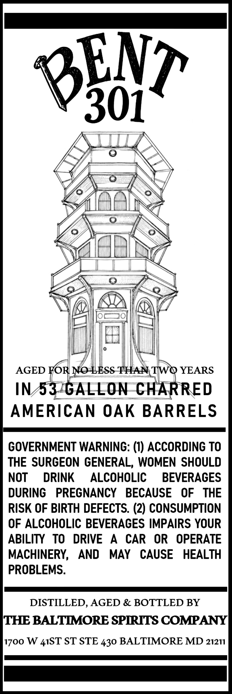
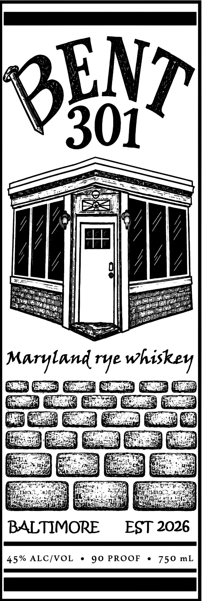

# TTB COLA Label Images - TTBID 26230001000540

**Brand Name:** BENT 301

**Issue Date:** 08/27/2026

**Origin Code:** 25

**Product Class/Type:** 142

**Source:** [TTB Public COLA Registry](https://ttbonline.gov/colasonline/viewColaDetails.do?action=publicFormDisplay&ttbid=26230001000540)

## Label Images

### Back Label

### Front Label

## Extracted Label Text

*Text extracted via OCR - may contain errors*

*1 image(s) excluded: text did not meet readability threshold*

### Back Label

BENT
301
AGED FOR NO LESS THAN TWQ YEARS
IN53
GALLON CHARRED
AMERICAN OAK BARRELS
GOVERNMENT WARNING: (1) ACCORDING TO
THE SURGEON GENERAL,; WOMEN SHOULD
NOT
DRINK
ALCOHOLIC
BEVERAGES
DURING
PREGNANCY
BECAUSE
OF
THE
RISK OF BIRTH DEFECTS. (2) CONSUMPTION
OF ALCOHOLIC BEVERAGES IMPAIRS YOUR
ABILITY
TO
DRIVE
A
CAR
OR
OPERATE
MACHINERY,
AND
MAY
CAUSE
HEALTH
PROBLEMS.
DISTILLED, AGED & BOTTLED BY
THE BALTMMORE SPIRITS COMPANY
1700 W
ST STE 430 BALTIMORE MD 21211
41ST
