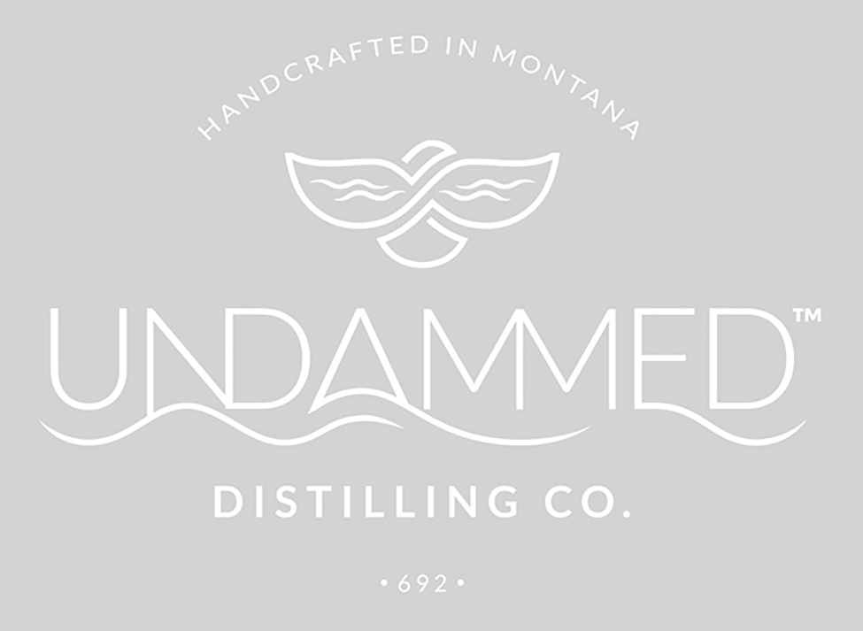
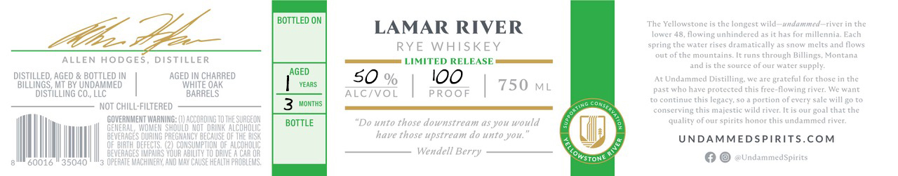

# TTB COLA Label Images - TTBID 26230001000587

**Brand Name:** LAMAR RIVER RYE WHISKEY

**Issue Date:** 09/09/2026

**Origin Code:** 30

**Product Class/Type:** 142

**Source:** [TTB Public COLA Registry](https://ttbonline.gov/colasonline/viewColaDetails.do?action=publicFormDisplay&ttbid=26230001000587)

## Label Images

### Label 1

### Label 2

## Extracted Label Text

*Text extracted via OCR - may contain errors*

*1 image(s) excluded: text did not meet readability threshold*

**Detected Proof:** 100

### Label 2

BOTTLED ON
The Yellowstonc
the longest wild
Mnand
tiver
che
LAMAR RIVER
Towet
flowing unhindered as
Haas
uilletnia, Each
RYE WHISKEY
spring the water rises dramatically
snow melts and flows
Qut ofthe mountains
Fmns
through Billings,
Vontin1
ALLEN HODGES _
DISTILLER
LIMITED RELEASE
and
Ehe source
our Witer
supplY
DISTILLED; AGED
BOTTLED IN
AGED IN CHARRED
AGED
50 %
IOO
At Undammed Distilling we are
Brateful for thase in the
BILLINGS, MT BY UNDAMMED
WwhITE OaK
VeaAS
750
ML
past who have protected this free-flowing river: We want
DISTILLING COv LLC
BARRELS
ALC/VOL
P ROO F
continuc this
legacy.
portion of every sale will 4o Eo
NoT chiLL-fiLteRED
MOnTHS
Gomi
conserving this majestic
ild tiven.
goal that che
GOVERHMNENT MARMUNG;
ACCOPDING To thE SUFGEON
BOTTLE
"Do unto tkose downstream @S yow would
qualicy of owr spirits honor chis undammed rivet;
GEMERAL; WO'
DRUE
AlLCOHOE
BEVERAGES DURUNG
NCY BECAUSE OF the RISK
have those upstream do unto you:
UNDAMMEDSP RITS.Com
OF BURTH @EFECTS , (2) CONSUMP:
OM Qf Alcohol
AEWERAGES
DAIVE
CAR MA
Wendell Berry
GUU16
35040
Operate MACHIMERY, Awd
chuse heALTH PAOBLERS;
aUUnduumedSpirits
Ino_
owstone
