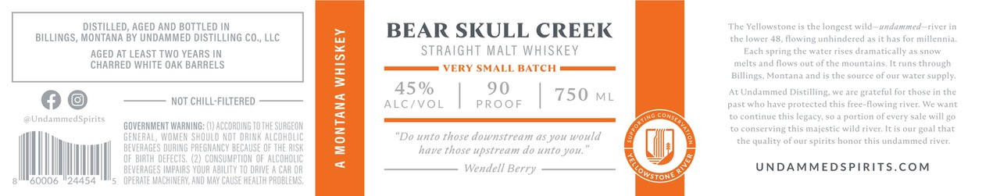

# TTB COLA Label Images - TTBID 26230001000597

**Brand Name:** BEAR SKULL CREEK STRAIGHT MALT WHISKEY

**Fanciful Name:** A MONTANA WHISKEY

**Issue Date:** 08/27/2026

**Origin Code:** 30

**Product Class/Type:** 117

**Source:** [TTB Public COLA Registry](https://ttbonline.gov/colasonline/viewColaDetails.do?action=publicFormDisplay&ttbid=26230001000597)

## Label Images

### Label 1

### Label 2

## Extracted Label Text

*Text extracted via OCR - may contain errors*

*1 image(s) excluded: text did not meet readability threshold*

**Detected Proof:** 90

### Label 2

DISTILLED, AGED ANd BOTTLED
BEAR SKULL CREEK
The Yellowstone
che longest wild
Jad
tiven
BILLINGS, MONTANA BY UNDAMMED DISTILLING Co , LLC
the lower 48
flowing unhindered as ic has for millennia:
AGED AT LEAST TWO YEARS IN
1
STRAIGHT MALT WHISKEY
Each spring the water rises dramatically as snow
CHARRED WHITE OAK BARRELS
melts and flows
ofthe mountains
Futs through
VERY SMALL BATCH
Billings Montana and
the source of Oui watet
supply:
45 %
90
750
At Undammed
Distilling;
WCAIC
grateful for those in the
NOT ChILL-FILTERED
ALC/VOL
P RO0F
ML
Past who have protected this free-flowing river: We want
Urcanne dSpurits
continue this
legacy;
portion of every
will 4o
GOMEAMMHERT WWARMNG;
ACCOROING TO THE SURGEOR
1
conserving this majestic wild river,
Fhat
GEMEAAL, WOMER Should RoT dRIMK
COHOLC
"Do unto tkose downstream @S yow would
che quality of our spirits honor this undammed river:
beveaages DUAING PAECmAnCY because OF The AISK
have those upstream do unto you:
OF BIRTH defects: (2}
CONSUMIPTHOH OF AlCohOLIC
beverages |MPAIAS YOUR AbilITY TO dRIve
CHM OR
Wendell Berry
UNDAMMEDSPIRITS.com
'SToNt
GUUUO
24454
operate WAChINERY, AMD MaY CauSe health problews,
u
Goxl
