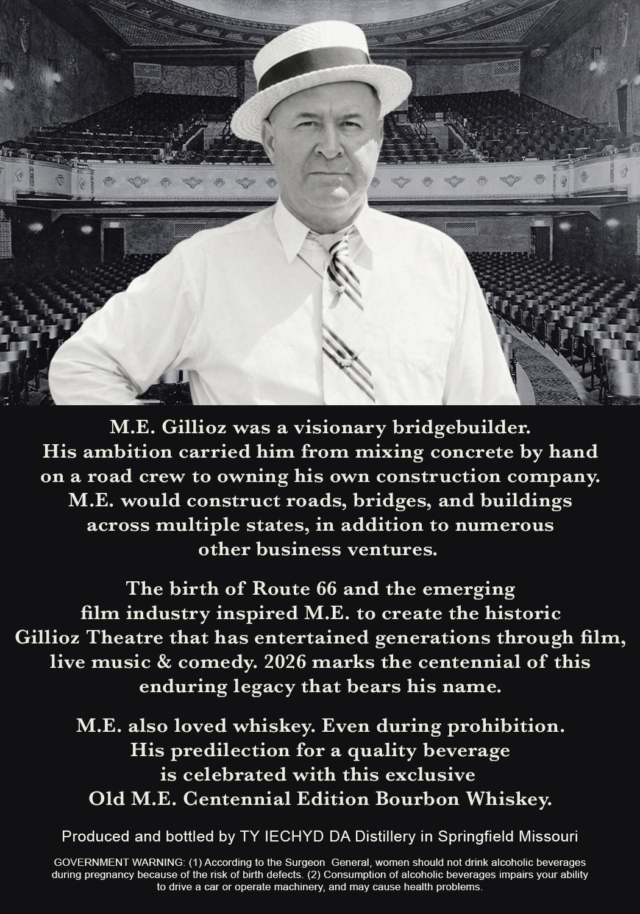
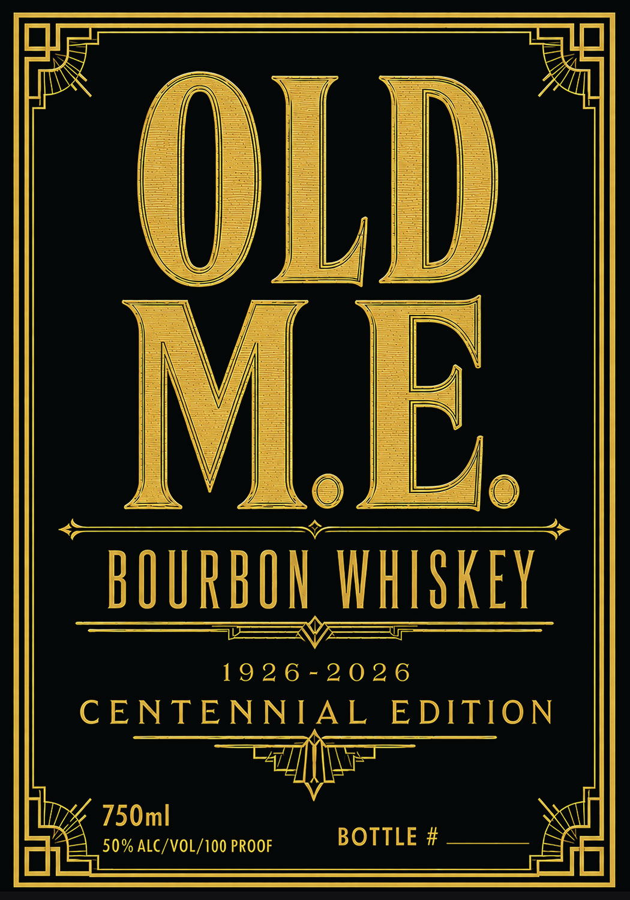
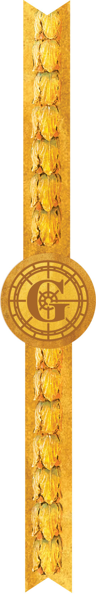

# TTB COLA Label Images - TTBID 26230001000621

**Brand Name:** OLD M.E.

**Fanciful Name:** CENTENNIAL EDITION

**Issue Date:** 08/27/2026

**Origin Code:** 29

**Product Class/Type:** 141

**Source:** [TTB Public COLA Registry](https://ttbonline.gov/colasonline/viewColaDetails.do?action=publicFormDisplay&ttbid=26230001000621)

## Label Images

### Back Label

### Front Label

### Label 3

## Extracted Label Text

*Text extracted via OCR - may contain errors*

*1 image(s) excluded: text did not meet readability threshold*

**Detected Proof:** 100

### Back Label

ME. Gillioz was
a
visionary bridgebuilder:
His ambition carried him from mixing concrete by hand
on a road crew to
owning his own construction company
ME would construct roads;
bridges, and buildings
across
multiple states, in addition to numerous
other business ventures:
The birth of Route 66 and the emerging
film industry inspired M.E. to create the historic
Gillioz Theatre that has entertained generations through
live music & comedy 2026 marks the centennial of this
enduring legacy that bears his name
ME. also loved whiskey Even during prohibition.
His predilection for a quality beverage
is celebrated with this exclusive
Old ME: Centennial Edition Bourbon Whiskey:
Produced and bottled by TY IECHYD DA Distillery in Springfield Missouri
GOVERNMENT WARNING: (1) According to the Surgeon
General, women should not drink alcoholic beverages
during pregnancy because of the risk of birth defects (2) Consumption of alcoholic beverages impairs your ability
to drive a car or operate machinery; and may cause health problems.
film,

### Front Label

OLD
ME
BOURBOH IHISKEY
19 2 6 - 2 0 2 6
C ENTENNIA L
EDITION
750ml
50% ALC/VOL/1OO PROOF
BOTTLE #
