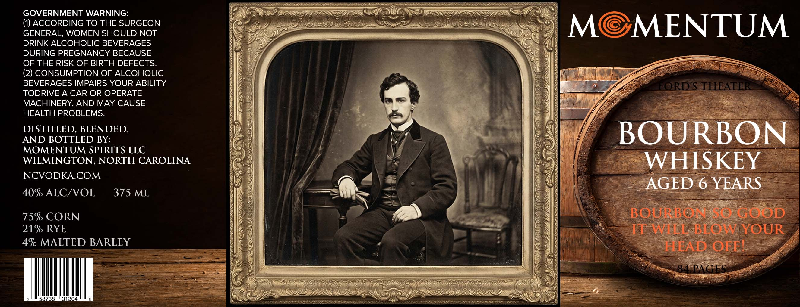

# TTB COLA Label Images - TTBID 26230001000629

**Brand Name:** MOMENTUM

**Issue Date:** 09/03/2026

**Origin Code:** 35

**Product Class/Type:** 141

**Source:** [TTB Public COLA Registry](https://ttbonline.gov/colasonline/viewColaDetails.do?action=publicFormDisplay&ttbid=26230001000629)

## Label Images

### Label 1

## Extracted Label Text

*Text extracted via OCR - may contain errors*

**Detected Proof:** 80
**Detected Age:** 6 Years

### Label 1

GOVERNMENT WARNING:
(1) ACCORDING TO THE SURGEON
MC
MENTUM
GENERAL, WOMEN SHOULD NOT
DRINK ALCOHOLIC BEVERAGES
DURING PREGNANCY BECAUSE
OF THE RISK OF BIRTH DEFECTS
(2) CONSUMPTION OF ALCOHOLIC
BEVERAGES IMPAIRS YOUR ABILITY
HORDS THEATER
TODRIVE A CAR OR OPERATE
MACHINERY, AND MAY CAUSE
HEALTH PROBLEMS:
DISTILLED, BLENDED
BOURBON
AND BOTTLED BY:
MOMENTUM SPIRITS LLC
WILMINGTON, NORTH CAROLINA
WHISKEY
NCVODKACOM
AGED 6 YEARS
40% ALCIVOL
375 ML
75% CORN
BOUEkORESGCon
21% RYE
H4 WITi BLOWYOUR
4% MALTED BARLEY
HEAD OFEL
84 PAGES
