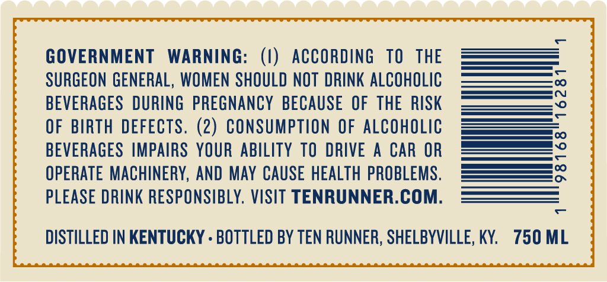
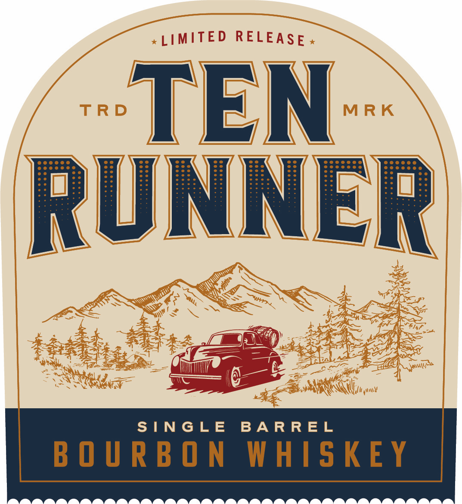
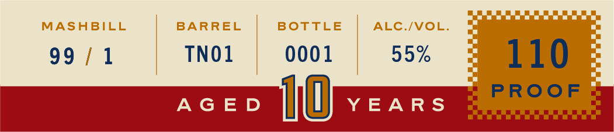

# TTB COLA Label Images - TTBID 26230001000653

**Brand Name:** TEN RUNNER

**Fanciful Name:** SINGLE BARREL

**Issue Date:** 08/25/2026

**Origin Code:** 22

**Product Class/Type:** 101

**Source:** [TTB Public COLA Registry](https://ttbonline.gov/colasonline/viewColaDetails.do?action=publicFormDisplay&ttbid=26230001000653)

## Label Images

### Back Label

### Front Label

### Label 2

## Extracted Label Text

*Text extracted via OCR - may contain errors*

*1 image(s) excluded: text did not meet readability threshold*

**Detected Proof:** 110

### Back Label

GOVERNMENT WARNING

(1) ACCORDING TO THE

SURGEON GENERAL, WOMEN SHOULD NOT DRINK ALCOHOLIC

BEVERAGES DURING PREGNANCY BECAUSE OF THE RISK

OF BIRTH DEFECTS. (2) CONSUMPTION OF ALCOHOLIC

BEVERAGES IMPAIRS YOUR ABILITY TO DRIVE A CAR OR ——

————

OPERATE MACHINERY, AND MAY CAUSE HEALTH PROBLEMS.

=Eeooo

PLEASE DRINK RESPONSIBLY. VISIT TENRUNNER.COM

—

DISTILLED IN KENTUCKY - BOTTLED BY TEN RUNNER, SHELBYVILLE, KY. 750 ML

### Label 2

Oe

MASHBILL

BARREL

BOTTLE

ALC./VOL

BE) fu

TNO1

0001

55%

AGED

YEARS

110
