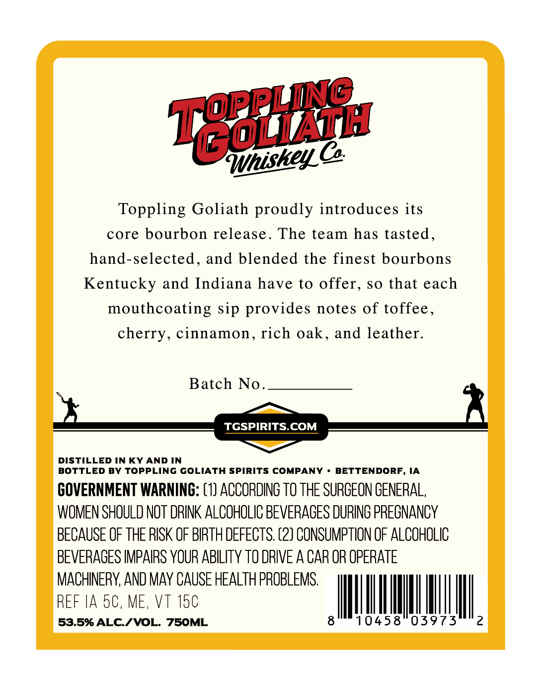
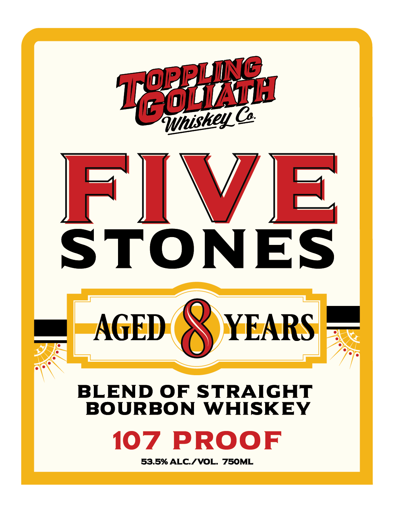

# TTB COLA Label Images - TTBID 26230001000759

**Brand Name:** TOPPLING GOLIATH WHISKEY, CO

**Issue Date:** 08/25/2026

**Origin Code:** 20

**Product Class/Type:** 120

**Source:** [TTB Public COLA Registry](https://ttbonline.gov/colasonline/viewColaDetails.do?action=publicFormDisplay&ttbid=26230001000759)

## Label Images

### Back Label

### Front Label

## Extracted Label Text

*Text extracted via OCR - may contain errors*

**Detected Proof:** 107
**Detected Age:** 8 Years

### Back Label

ynishey A

Toppling Goliath proudly introduces its

core bourbon release. The team has tasted

hand-selected, and blended the finest bourbons

Kentucky and Indiana have to offer, so that each

mouthcoating sip provides notes of toffee

cherry, cinnamon, rich oak, and leather

Batch No

—_~

TGSPIRITS.COM

DISTILLED IN KY AND IN

I

BOTTLED BY TOPPLING GOLIATH SPIRITS COMPANY + BETTENDORF, IA

GOVERNMENT WARNING: (1) ACCORDING TO THE SURGEON GENERAL,

WOMEN SHOULD NOT DRINK ALCOHOLIC BEVERAGES DURING PREGNANCY

BECAUSE OF THE RISK OF BIRTH DEFECTS. (2) CONSUMPTION OF ALCOHOLIC

BEVERAGES IMPAIRS YOUR ABILITY T0 DRIVE A CAR OR OPERATE

MACHINERY, AND MAY CAUSE HEALTH PROBLEMS

REF IA 50, ME, VT an

MUA

53.5% ALC./VO

### Front Label

Tegel

FIVE

STONES

mn AGED 8 YEARS

BLEND OF STRAIGHT

BOURBON WHISKEY

107 PROOF

53.5% ALC./VOL. 750ML
