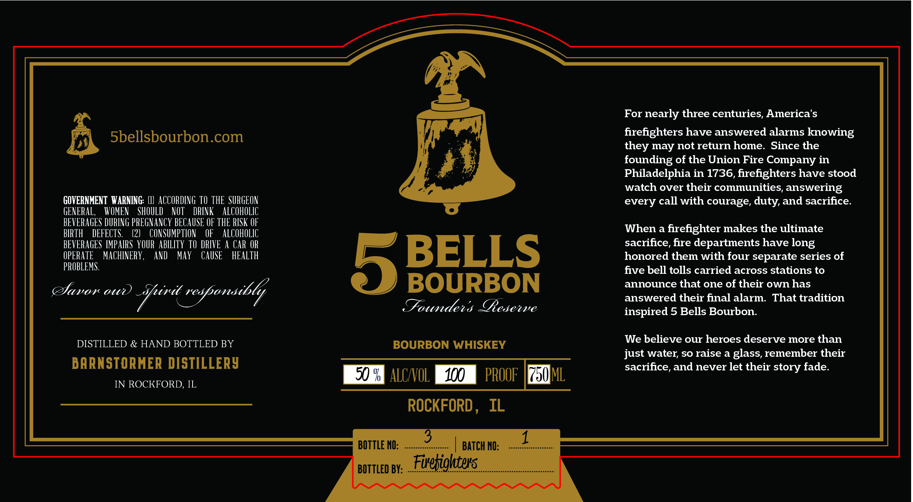

# TTB COLA Label Images - TTBID 26231001000002

**Brand Name:** 5 BELLS BOURBON

**Issue Date:** 08/26/2026

**Origin Code:** 04

**Product Class/Type:** 141

**Source:** [TTB Public COLA Registry](https://ttbonline.gov/colasonline/viewColaDetails.do?action=publicFormDisplay&ttbid=26231001000002)

## Label Images

### Label 1

### Label 2

## Extracted Label Text

*Text extracted via OCR - may contain errors*

*1 image(s) excluded: text did not meet readability threshold*

### Label 1

5bellsbourbon.com

GOVERNMENT WARNING: (1) ACCORDING TO THE SURGEON
GENERAL, WOMEN SHOULD NOT DRINK ALCOHOLIC
BEVERAGES DURING PREGNANCY BECAUSE OF THE RISK OF
BIRTH DEFECTS. (2) CONSUMPTION OF ALCOHOLIC
BEVERAGES IMPAIRS YOUR ABILITY TO DRIVE A CAR OR
OPERATE MACHINERY, AND MAY CAUSE HEALTH
PROBLEMS.

Davor our ane ae

DISTILLED & HAND BOTTLED BY

BARNSTORMER DISTILLERY

IN ROCKFORD, IL

BOURBON
Founders Resewe

BOURBON WHISKEY

BEA 4100), PRO |.

ROCKFORD, IL

BOTTLE NO: ....
BOTTLED BY:

For nearly three centuries, America's

firefighters have answered alarms knowing
they may not return home. Since the
founding of the Union Fire Company in
Philadelphia in 1736, firefighters have stood
watch over their communities, answering
every call with courage, duty, and sacrifice.

When a firefighter makes the ultimate
sacrifice, fire departments have long
honored them with four separate series of
five bell tolls carried across stations to
announce that one of their own has
answered their final alarm. That tradition
inspired 5 Bells Bourbon.

We believe our heroes deserve more than
just water, so raise a glass, remember their
sacrifice, and never let their story fade.
