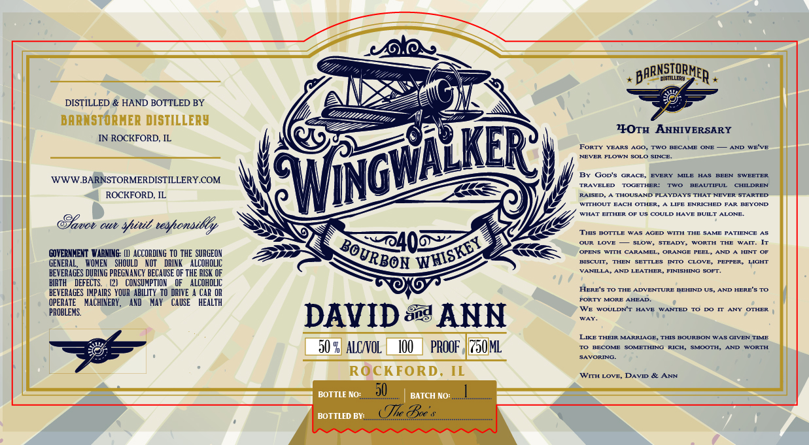

# TTB COLA Label Images - TTBID 26231001000006

**Brand Name:** WINGWALKER

**Issue Date:** 08/25/2026

**Origin Code:** 04

**Product Class/Type:** 141

**Source:** [TTB Public COLA Registry](https://ttbonline.gov/colasonline/viewColaDetails.do?action=publicFormDisplay&ttbid=26231001000006)

## Label Images

### Label 1

## Extracted Label Text

*Text extracted via OCR - may contain errors*

### Label 1

BArNsiQRMER
Fdis] LLERU
DISTILLED & HAND BOTTLED BY
BARNST ORHER DISTILLERy
4OTH AnNIVERSARY
ROCKFORD, IL
FoRTy
YRARS
ACO
Tt0
RECAHE
@HE
AND WE VE
HEUERI
FLOUm
SI~CF
Gop's
@RACF
EVERY
MILE
HAS
BEEN
SWEETER
WWWBARNSTORMERDISTILLERY COM
TRLA VELED
TOmETHERI
TAUO
RFATTIFT
CHEDREAT
ROCKFORD, IL
RAISED
THOUSAND PLAYDAYS
THAT NEVER
STARTED
WTTHOUT
EACH OTHER_
LIFE
ENRICHED
BEYOND
IUHATT
ETTHER
OF US
COULD
HA VE
RULT
ALOHE
Tvov
OIy
shitb tesfonsilly
THiS BOTTLE
WAS
AQED
WITH
SAME PATIENCE AS
OURA
LOVE
SLOW
STEADY
IORTTH
LAM
GOVERNHENT VarNiNG: [L]  ACCORDING TO THE SURGEON
Bo
@PENS
LUTTH
CARA HET
@RARCE
PEEL A
AND
HMTT
GENERAL;
WOMEN
SHOULD
XOT
DRINK
ALCOHOLIC
BISCUIT ,
THEN
SETTLES
INTO
CLOVE
PEPPER
LIGHT
VANILLA
AND LEATHER_
FINISHING
SOFT
BEVERAGES DURING PREGNANCY BECAUSE OF THE RISK OF
BIRTH
DEFECTS
CONSUMPTION
ALCOHOLIC
HFRF' s
LDUELTTURIF
BEHIND
HERE'R To
BEVERAGES IMPAIRS  YOUR AbILITy  TO DRIVE
CAR OR
FORTI
MORF
AHEAD
OPERATE
MACHINERY _
AND
May
CAUSE
HEALTH
WE
WOULDNT
Hianr
HakmTET
OCTHEB
PROBLEMS:
DAVID &g ANN
Mal
LIKE THEIR
MARRIAGE, THIS BOURBON WAS @IVEN TIME
% ALCNOL
PROOF ,
JML
BECOME
SOO ETHINC
MCH
SMOOTH
IUORTH
BAVORING
ROcKFORD,
IL
WITH LOVE
DAVID &
4NN
BOTTLE NO:
50
BATCH NO:
BOTTLED BV:_
(Jlc Boc
Wiowkd
WHISKEY
URBOH _
