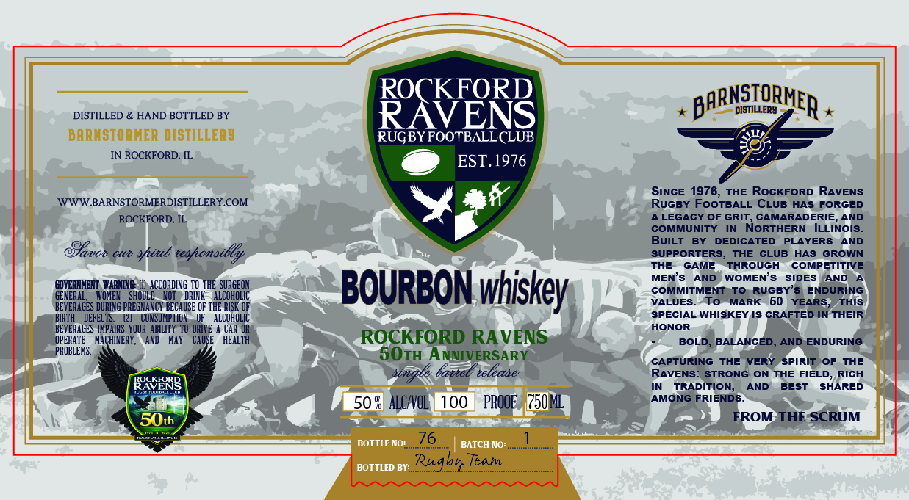

# TTB COLA Label Images - TTBID 26231001000008

**Brand Name:** ROCKFORD RAVENS

**Issue Date:** 08/25/2026

**Origin Code:** 04

**Product Class/Type:** 141

**Source:** [TTB Public COLA Registry](https://ttbonline.gov/colasonline/viewColaDetails.do?action=publicFormDisplay&ttbid=26231001000008)

## Label Images

### Label 1

## Extracted Label Text

*Text extracted via OCR - may contain errors*

**Detected Age:** 50 Years

### Label 1

ROCKFORD
BARNSTORMER
DISTILLERY
DISTILLED & HAND BOTTLED BY
RAVENS
BARNSTORHER DISTILLERY
RUGBYFOOTBALLCLUB
IN ROCKFORD; IL
EST.1976
SINCE 1976_
THE RoCKFORD
RAVENS
WWWBARNSTORMERDISTILLERY.COM
RuGby FOOTBALL CLUB HAS FORGED
ROCKFORD, IL
A LEGACY OF GRIT
CAMARADERIE,
AND
COMMUNITY
NORTHERN
ILLINOIS_
@80
BuILT
BY
DEDICATED
PLAYERS
AND
TUou
Clu
shitib teshonsilly
SUPPORTERS
THE
CLUB
HAS
GROWN
THE
GAME
THROUGH
COMPETITIVE
MEN'$
AND
WOMEN $
SIDES
AND
GQVERMMEMZ VarNING:
ACCORDING TO THE SURGEON
BOURBON
COMMITMENT
To
RUGBY'$
ENDURING
GENERAL_
WOMEN
SHOULD
NOT
DRINK
ALCOHOLIC
VALUES_
To
MARK
50
YEARS
THIS
BEVERAGES DURING PREGNANCY BECAUSE OF THE RISK OF
BIRTH
DEFECTS
CONSUNPTION
ALCOHOLIC
SPECIAL WHISKEY IS CRAFTED IN THEIR
BEVERAGES IMPAIRS   YOUR   ABILITY TO DRIVE
CAR OR"
HONOR
OPERATE
MACHINERY ,
AND
Hay
CAUSE
HEALTH
ROCKFORD RA VENS
BOLD,
BALANCED
AND ENDURING
PROBLEMS:
SOTH ANNIVERSARY
CAPTURING
THE VERY
SPIRIT
OF THE
lattel telease
RAVENS: STRONG
ON
THE FIELD_
RICH
ROSR5g
TRADITION;
AND
BEST
SHARED
% ALCNOL}
PROOF
MML
AMONG FRIENDS
50th
FROM THE SCRUM
TaiIluruit
76
BOTTLE NO:
BATCH NO:
BOTTLED BV: _
bn Team_
whiskey
single
Rug-
