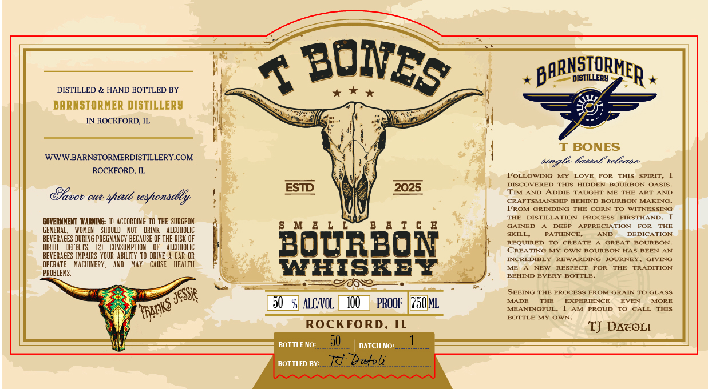

# TTB COLA Label Images - TTBID 26231001000009

**Brand Name:** T BONES

**Issue Date:** 08/25/2026

**Origin Code:** 04

**Product Class/Type:** 141

**Source:** [TTB Public COLA Registry](https://ttbonline.gov/colasonline/viewColaDetails.do?action=publicFormDisplay&ttbid=26231001000009)

## Label Images

### Label 1

## Extracted Label Text

*Text extracted via OCR - may contain errors*

### Label 1

7 BONES
BARNSIORMER
DISTILLERY
DISTILLED & HAND BOTTLED BY
BARNSTORNER DISTILLERy
IN ROCKFORD; IL
BONES
WWW BARNSTORMERDISTILLERY COM
fattel telease
ROCKFORD, IL
FoLLOWING
MY
LOVE
FOR
THIS
SPIRIT _
DISCOVERED
THS
HDDEN
BOuREOn
OASIS .
ESID
2025
TIM
ANIDD
ADDIE TAUGHT
THE
ART
AND
coU Cllu
sitib teshonsidly
CRAFTSHANSHD
BEHIND
BOURBON MAKING_
FROM GRINDING THE CORN TO
WITNESSING
TLE
DISTILLATOR
PROCESS
FIRSTHAND,
GOVERNMENT VarNING: (L]  ACCORDING TO THE SURGEON
M  L
4 q 6
GAINED
DEEP
APPRECETION
FOR
THE
GENERAL;
WOMEX
SHOULD
XuI
DRINK
ALCOHOLIC
SKILL
PATIENCE_
AND
DEDICATION
BEVERAGES DURING PREGNANCY BECAUSE OF THE RISK OF
3071203
REQUIRED
CREATE
GREAT
BOUREON-
BIRTH
DEFECTS
CONSUNPTION
LCOHOLIC
CREATING MY
@VN
BOuREOn
HS
enee
BEVERAGES IMPAIRS YOUR   ABILITY  TO DRIVE
CAR OR
INCREDIBLY
REWARDING
JOURNEY
GIVING
OPERATE
MACHINERY ,
AND
May
CAUSE
HEALTH
WES<E >
ME
NEHT
RESPECT
FOR
THE
TRADITION
PROBLEMS:
BEHND
EVERY
BOTTLE
SEEING THE PROCESS FROM GRAIN TO GLASS
Jessif
%  ALCNOL
PROOF
JML
MADE
THE
EXPERIENCE
EVEN
MORE
NE A NINGFUI
AM
PROUD
CALL
THIS
BOTTLE MY
OWN-
ROCKFORD, IL
TJ DATOLL
BOTTLE NO:
50
BATCH NO:
BOTTLED BV:_
Zd_bakli
"n94
R64ngks =
