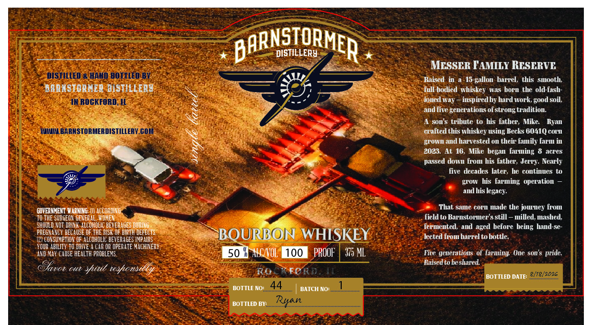

# TTB COLA Label Images - TTBID 26231001000010

**Brand Name:** MESSER FAMILY RESERVE

**Issue Date:** 08/27/2026

**Origin Code:** 04

**Product Class/Type:** 141

**Source:** [TTB Public COLA Registry](https://ttbonline.gov/colasonline/viewColaDetails.do?action=publicFormDisplay&ttbid=26231001000010)

## Label Images

### Label 1

## Extracted Label Text

*Text extracted via OCR - may contain errors*

### Label 1

BARNSIORMER
DISTILLERY
MESSER FAMILY RESERVE
DISTHLLED & HAHD BOTTLED BV
Raised  in a-15-gallonbarrel, this   smooth
AAAASTOANEE DiSTILLEAS
Full-hotied nhiskey was born the old-fash-
IN ROGKFORD_
ionetl
inspiredby hard work; good soil,
ad five generations of strong tradition
son $ tribute to his father; Mike
Kyan
WLMLBARMSTORMERDISTILLERV.GOM
crafted this nhiskey using Becks 60410 cOLn
grOwn and harvested 0n their family farm in
2023
At 16
Mike
farmning 8
acreS
passed town
his
Nearly
fire   tecates later, he contines
grow
lis
farming  operation
art his legacy:
GOVERNMENT WARNING: (I] ACCOADING
That samne COrn Made the jouney from
TO THE SURGEOR GENERAL;WYOMEM
field to Barustorqer'$ still
milled, mashed
shOuLD NOT DPIX K aLCOHOLIC BETERAGES DURING
fermentetl; ant
before heing hand-se-
PREGNANCY BECAUSE OF THE HISK OF BIRTH DEFECTS
BOURBON WHISKEY
lected from barrel to bottle
[21 COX SUMPTION CF ALCOHOLIC BETERAGES IMPAIRS
YQUR ABILITY TO DAIVE
CAR OR OPERATE MACHIXERY
AND MAY CAUSE HEALTH prObLEMS.
AICNOL;
PROOF
375 ML
Five generations of
One
pride:
Raised to be shared
Savot
Ouv
shiut reshonbddly
R"FOR,[
2/18/2026
BOTTLED DATE:
BOTTLE Noi
44
BATCH NO:
BOTTLED BV:_
Ryan
Tar
hegan
front
father
Jerry:
aget
son '$
farqing
