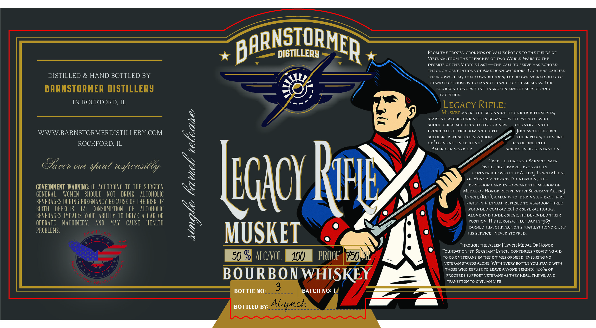

# TTB COLA Label Images - TTBID 26231001000011

**Brand Name:** LEGACY RIFLE

**Issue Date:** 08/26/2026

**Origin Code:** 04

**Product Class/Type:** 141

**Source:** [TTB Public COLA Registry](https://ttbonline.gov/colasonline/viewColaDetails.do?action=publicFormDisplay&ttbid=26231001000011)

## Label Images

### Front Label

## Extracted Label Text

*Text extracted via OCR - may contain errors*

**Detected Proof:** 100

### Front Label

BARNSIQRMER
DISTILLERY
FRoM THE FROZEN GROUNDS OF VALLEY FORGE TO THE FIELDS OF
VIETNAM, FROM THE TRENCHES OF TWO WoRLD WARS TO THE
DESERTS OF THE MIDDLE EAST
THE CALL TO SERVE HAS ECHOED
THROUGH GENERATIONS OF AMERICAN WARRIORS. EACH HAS CARRIED
DISTILLED
HAND BOTTLED BY
THEIR OWN RIFLE, THEIR OWN BURDEN, THEIR OWN SACRED DUTY TO
STAND FOR THOSE WHO CANNOT STAND FOR THEMSELVES. THIS
DARNSTORMER DISTILLERy
BOURBON HONORS THAT UNBROKEN LINE OF SERVICE
AND
SACRIFICE.
IN ROCKFORD, IL
LEGACY RIFLE:
MuSKET MARKS THE BEGINNING OF OUR TRIBUTE SERIES,
STARTING WHERE OUR NATION BEGAN
WITH PATRIOTS WHO
SHOULDERED MUSKETS TO FORGE A NEW
COUNTRY ON THE
WWW BARNSTORMERDISTILLERY COM
1
PRINCIPLES OF FREEDOM AND DUTY.
Just As THOSE FIRST
SOLDIERS REFUSED TO ABANDON
THEIR POSTS, THE SPIRIT
ROCKFORD, IL
OF
LEAVE NO ONE
BEHIND"
HAS DEFINED THE
AMERICAN WARRIOR
ACROSS EVERY GENERATION
CRAFTED THROUGH BARNSTORMER
OUi
teshonsilly
DiSTILLERY'S BARREL PROGRAM IN
1
PARTNERSHIP WITH THE
ALLEN
LYNCH MEDAL
EGHOY
OPHONONVARRIENS DRWARR TOE NISON_
OF
GOVERNMENT   WARNING:
ACCORDING TO THE  SURGEON
MEDAL OF HoNOR RECIPIENT IST SERGEANT ALLEN ]:
GENERAL,
WVOMEN
SHOULD
NOT
DRINK
ALCOHOLIC
LYNCH; (RET.), A MAN WHO, DURING A FIERCE
FIRE
BEVERAGES DURING PREGNANCY BECAUSE OF THE RISK OF
FIGHT IN VIETNAM, REFUSED TO ABANDON THREE
BIRTH
DEFECTS:
(2]
CONSUMPTION
OF
ALCOHOLIC
WOUNDED COMRADES. FoR SEVERAL HOURS,
BEVERAGES IMPAIRS  YOUR  ABILITy TO  DRIVE A CAR OR
ALONE AND UNDER SIEGE, HE DEFENDED THEIR
OPERATE
MACHINERY ,
AND
MAy
CAUSE
HEALTH
X
POSITION: His HEROISM THAT DAY IN 1967
EARNED HIM OUR NATION'$ HIGHEST HONOR, BUT
PROBLEMS.
MUSKET
HIS SERVICE
NEVER STOPPED.
THRouGH THE ALLEN
LYNcH MEDAL OF HONOR
FoUNDATION IST SERGEANT LYNCH
CONTINUES PROVIDING AID
50 % ALCNOL
100
PROOF | 750
TO OUR VETERANS IN THEIR TIMES OF NEED, ENSURING NO
VETERAN STANDS ALONE. WiTH EVERY BOTTLE YOU STAND WITH
THOSE WHO REFUSE TO LEAVE ANYONE BEHIND! 1oo% OF
BOURBON WHISKEY
PROCEEDS SUPPORT VETERANS AS THEY HEAL, THRIVE, AND
TRANSITION TO CIVILIAN LIFE.
BOTTLE NO:
3
BATCH NO:
BOTTLED BY:
Alynch
Rul
Eavov
%itt

Mene
6
L
Fnn
tee
