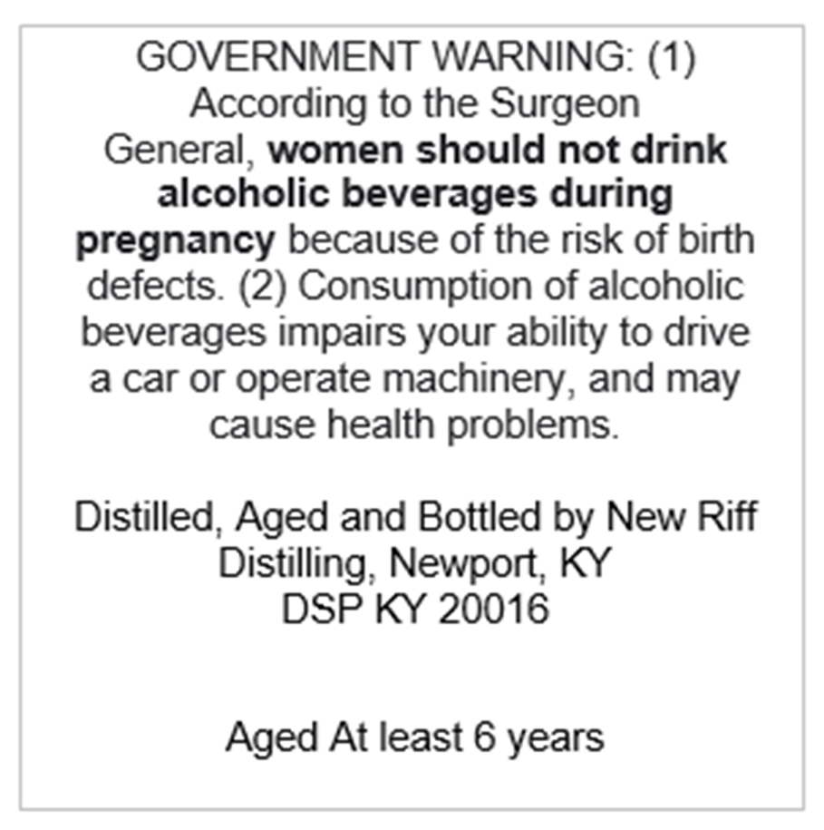
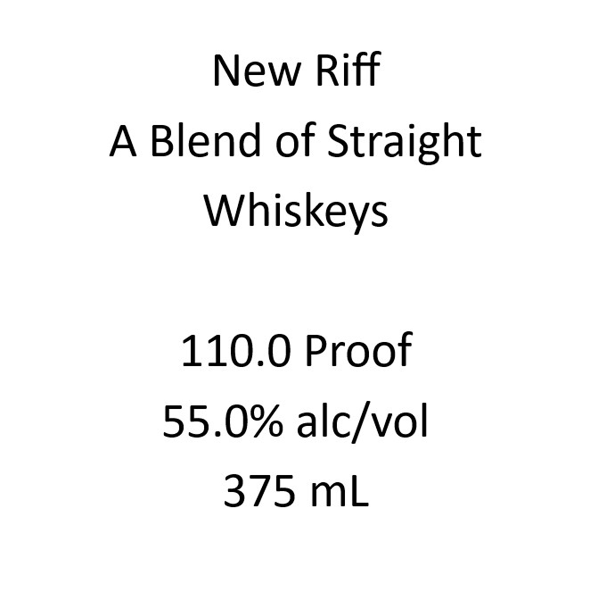

# TTB COLA Label Images - TTBID 26231001000084

**Brand Name:** NEW RIFF

**Issue Date:** 08/25/2026

**Origin Code:** 22

**Product Class/Type:** 120

**Source:** [TTB Public COLA Registry](https://ttbonline.gov/colasonline/viewColaDetails.do?action=publicFormDisplay&ttbid=26231001000084)

## Label Images

### Back Label

### Front Label

## Extracted Label Text

*Text extracted via OCR - may contain errors*

**Detected Proof:** 110
**Detected Age:** 6 Years

### Back Label

GOVERNMENT WARNING: (1)
According to the Surgeon
General
women should not drink
alcoholic beverages during
pregnancy because of the risk of birth
defects. (2) Consumption of alcoholic
beverages impairs your ability to drive
a car Or
operate machinery, and may
cause health
problems.
Distilled,
Aged and Bottled by New Riff
Distilling; Newport; KY
DSP KY 20016
Aged At least 6 years

### Front Label

New Riff

A Blend of Straight

Whiskeys

110.0 Proof

55.0% alc/vol

375 mL
